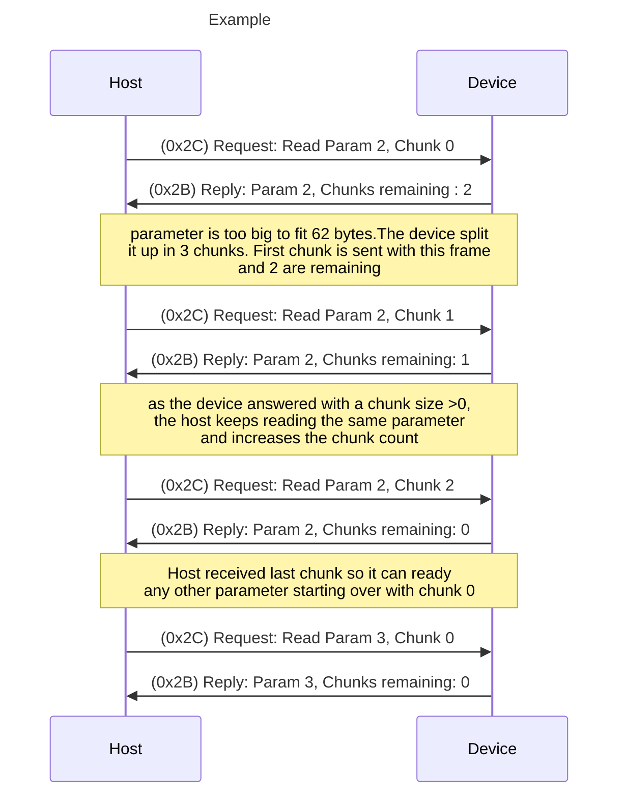
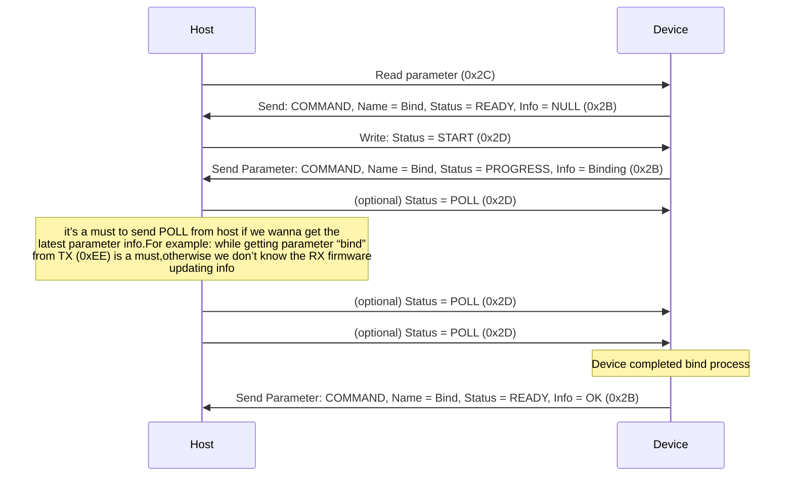
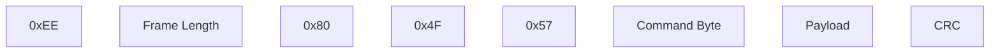
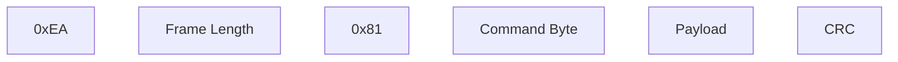
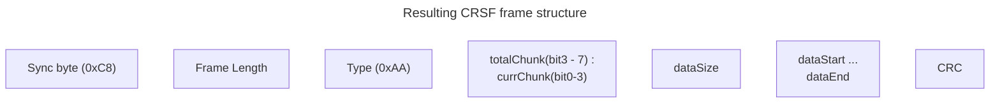

# CRSF Protocol

# Table of Contents

- [CRSF Protocol](#crsf-protocol)
- [Table of Contents](#table-of-contents)
- [Features](#features)
- [Purpose](#purpose)
- [Acronyms](#acronyms)
- [Hardware](#hardware)
  - [Single-Wire Half-Duplex UART](#single-wire-half-duplex-uart)
  - [Dual-Wire Full-Duplex UART](#dual-wire-full-duplex-uart)
  - [Multi-master I2C (BST)](#multi-master-i2c-bst)
- [Frame Construction](#frame-construction)
  - [Structure](#structure)
  - [Broadcast Frame](#broadcast-frame)
  - [Extended Header Frame](#extended-header-frame)
  - [Frame Details](#frame-details)
- [Routing](#routing)
- [CRC](#crc)
- [Device Addresses](#device-addresses)
- [Broadcast Frame Types](#broadcast-frame-types)
  - [0x02 GPS](#0x02-gps)
  - [0x03 GPS Time](#0x03-gps-time)
  - [0x06 GPS Extended](#0x06-gps-extended)
  - [0x07 Variometer Sensor](#0x07-variometer-sensor)
  - [0x08 Battery Sensor](#0x08-battery-sensor)
  - [0x09 Barometric Altitude & Vertical Speed](#0x09-barometric-altitude--vertical-speed)
  - [0x0A Airspeed](#0x0a-airspeed)
  - [0x0B Heartbeat](#0x0b-heartbeat)
  - [0x0C RPM](#0x0C-rpm)
  - [0x0D TEMP](#0x0D-temp)
  - [0x0E Voltages](#0x0E-voltages-or-voltage-group)
  - [0x0F Discontinued](#0x0f-discontinued)
  - [0x10 VTX Telemetry](#0x10-vtx-telemetry)
  - [0x11 Barometer](#0x11-barometer)
  - [0x12 Magnetometer](#0x12-magnetometer)
  - [0x13 Accel/Gyro](#0x13-accel-gyro)
  - [0x14 Link Statistics](#0x14-link-statistics)
  - [0x16 RC Channels Packed Payload](#0x16-rc-channels-packed-payload)
  - [0x17 Subset RC Channels Packed](#0x17-subset-rc-channels-packed)
  - [0x18 RC Channels Packed 11-bits (Unused)](#0x18-rc-channels-packed-11-bits-unused)
  - [0x19 - 0x1B Reserved Crossfire](#0x19---0x1b-reserved-crossfire)
  - [0x1C Link Statistics RX](#0x1c-link-statistics-rx)
  - [0x1D Link Statistics TX](#0x1d-link-statistics-tx)
  - [0x1E Attitude](#0x1e-attitude)
  - [0x1F MAVLink FC](#0x1f-mavlink-fc)
  - [0x21 Flight Mode](#0x21-flight-mode)
  - [0x22 ESP_NOW Messages](#0x22-esp_now-messages)
  - [0x27 Reserved](#0x27-reserved)
- [Extended Frame Types](#extended-frame-types)
  - [0x28 Parameter Ping Devices](#0x28-parameter-ping-devices)
  - [0x29 Parameter Device Information](#0x29-parameter-device-information)
  - [Chunks](#chunks)
  - [0x2B Parameter Settings (Entry)](#0x2b-parameter-settings-entry)
    - [Parameter Type Definitions & Hidden Bit](#parameter-type-definitions--hidden-bit)
    - [OUT_OF_RANGE](#out_of_range)
    - [UINT8, INT8, UINT16, INT16, UINT32, INT32](#uint8-int8-uint16-int16-uint32-int32)
    - [FLOAT](#float)
    - [TEXT_SELECTION](#text_selection)
    - [STRING](#string)
    - [FOLDER](#folder)
    - [INFO](#info)
    - [COMMAND](#command)
  - [0x2C Parameter Settings (Read)](#0x2c-parameter-settings-read)
  - [0x2D Parameter Value (Write)](#0x2d-parameter-value-write)
  - [0x32 Direct Commands](#0x32-direct-commands)
    - [0x32.0xFF Command ACK](#0x320xff-command-ack)
    - [0x32.0x01 FC Commands](#0x320x01-fc-commands)
    - [0x32.0x03 Bluetooth Command](#0x320x03-bluetooth-command)
    - [0x32.0x05 OSD Commands](#0x320x05-osd-commands)
    - [0x32.0x08 VTX Commands](#0x320x08-vtx-commands)
    - [0x32.0x09 LED](#0x320x09-led)
    - [0x32.0x0A General](#0x320x0a-general)
    - [0x32.0x10 Crossfire](#0x320x10-crossfire)
    - [0x32.0x12 Reserved](#0x320x12-reserved)
    - [0x32.0x20 Flow Control Frame](#0x320x20-flow-control-frame)
    - [0x32.0x22 Screen Command](#0x320x22-screen-command)
      - [0x32.0x22.0x01 Pop-up Message Start](#0x320x220x01-pop-up-message-start)
      - [0x32.0x22.0x02 Selection Return Value](#0x320x220x02-selection-return-value)
      - [0x32.0x22.0x03 Reserved](#0x320x220x03-reserved)
      - [0x32.0x22.0x04 Reserved](#0x320x220x04-reserved)
  - [0x34 Logging](#0x34-logging)
  - [0x36 Reserved](#0x36-reserved)
  - [0x38 Reserved](#0x38-reserved)
  - [0x3A - Remote Related Frames](#0x3a---remote-related-frames)
    - [0x3A.0x01 - 0x3A.0x09 - Reserved](#0x3a0x01---0x3a0x09---reserved)
    - [0x3A.0x10 Timing Correction (CRSF Shot)](#0x3a0x10-timing-correction-crsf-shot)
  - [0x3C Game](#0x3c-game)
  - [0x3E Reserved](#0x3e-reserved)
  - [0x40 Reserved](#0x40-reserved)
  - [0x78 - 0x79 KISSFC Reserved](#0x78---0x79-kissfc-reserved)
  - [0x7A MSP Request / 0x7B Response](#0x7a-msp-request--0x7b-response)
  - [0x7F ArduPilot Legacy Reserved](#0x7f-ardupilot-legacy-reserved)
  - [0x80 ArduPilot Reserved Passthrough Frame](#0x80-ardupilot-reserved-passthrough-frame)
  - [0x81, 0x82 mLRS Reserved](#0x81-0x82-mlrs-reserved)
  - [0xAA CRSF MAVLink Envelope](#0xaa-crsf-mavlink-envelope)
  - [0xAC CRSF MAVLink System Status Sensor](#0xac-crsf-mavlink-system-status-sensor)
- [End of Document](#end-of-document)

# Features

- Low latency high update rate for RC signals between RC - TX and RX - FC
- Bidirectional communication
- Share telemetry from flying platform to the RC
- Edit configuration for direct connected devices and remotely connected devices (RC can configure FC or OSD over CRSF)
- Share receiver serial number to TX, so it can be matched to model memory.

# Purpose

This document serves as a public "single source of truth", maintained by TBS, documenting the protocol. It serves as reference for implementation of CRSF-compatible devices, as well as allows developers not associated with TBS to voice requirements and suggest extensions to the existing protocols. It will further establish CRSF as the most widely implemented modern communication protocol for R/C devices.

# Acronyms

- **CRSF** Binary frame-based protocol for radio-controlled devices. The subject of this document.
- **RC** Remote Controller. The pilot control input device.
- **TX** Transmitter (which is actually a transceiver). Usually a part (external or embedded as a radio module) of RC.
- **RX** Receiver (which is also a transceiver). Might be as a separate device or embedded with FC or VTX.
- **FC** Flight Controller.
- **VTX** Video Transmitter.
- **VRX** Video Receiver.

# Hardware

## Single-Wire Half-Duplex UART

This configuration is usually used between RC and TX. The RC acts as master in this case and TX responds with telemetry if it’s synchronized to the RC frames sent by the RC. The RC must send only one frame with pre-configured or negotiated frequency and must switch the line into the high-impedance mode and wait for a response from TX.

The UART by default runs at **400 kbaud 8N1** (inverted or non-inverted) at **3.3V** level, but it also supports 115.2 kbaud, and higher (1Mbaud, 2Mbaud) depending on hardware (see [0x70 CRSF Protocol Speed Proposal](#0x320x0a-general)). It is recommended that TX modules are configured to the same baud rate, or that they latch on to the correct baudrate automatically. The maximum frame-rate must be chosen depending on the baudrate for be able for RC and TX send frames with maximum length (64 bytes) in one frame.

## Dual-Wire Full-Duplex UART

This configuration is usually used on the flying platform side. Two devices are connected by regular UART connection. Only non-inverted (regular) UART is supported in this configuration. The UART runs by default at **416666 baud 8N1 at 3.0 to 3.3V level**, but baudrate can be negotiated to be higher to facilitate faster transmission for reducing latency.

## Multi-master I2C (BST)

(EOL) BST is a multi master I2C bus. It runs at 3.3V level at 100kHz using 7 bit addresses. Device addresses already contain the R/W bit. Which means the list is each device’s write address and read address is Device addresses + 1. Each device supporting BST should release SDA in any case to not block the bus. It’s recommended to monitor the heartbeat message and reset the interface if there is a timeout of 1.5s. It’s required to support general call frames which will be called broadcast frames within this document.

# Frame Construction

## Structure

The basic structure for each frame is the same. There is a range of Types with an extended header which will have the first few bytes of payload standardized. This is required to route frame across multiple devices for point to point communication. Each CRSF frame is not longer than **64 bytes** (including the Sync and CRC bytes)

## Broadcast Frame


## Extended Header Frame


## Frame Details

- **Sync byte** might be one of (so, receiving device should expect any of):
  - Serial sync byte: **0xC8**;
  - Broadcast device address: **0x00**;
  - Device address (see addresses below).
- **Frame length:** number of bytes in the frame excluding Sync byte and Frame Length (basically, entire frame size -2)
  - **Broadcast Frame:** Type + Payload + CRC
  - **Extended header frame:** Type + Destination address + Origin address + Payload + CRC
  - Valid range is between 2 and 62. If this uint8 value is out of valid range the frame must be discarded.
- **Type:** Frame type
- **Endianness:** Big endian (MSB)

Frame size may be bigger than expected frame of given type. This should not be a reason to count the frame invalid. Frame receiver should just ignore extra fields. It's possible that frame sender supports a newer CRSF protocol version and sends some additional fields after known ones.

And vice-versa: if a frame has some optional fields, sometimes this fields might be set as empty fields (e.g. zero-length null-terminated string) but sometimes those fields might be absent and the frame size shortened. Don't try to read optional fields beyond frame payload.

# Routing

If a device has more than one CRSF port it’s required to forward all received frames to the other ports. CRSF works as a star network with fixed address tables on each node. It’s forbidden to use any loop connection as it would keep forwarding the same message endlessly.

# CRC

CRC includes Type and Payload of each frame (doesn't include sync byte and frame length).

CRC8 implementation with polynom = x7+ x6+ x4+ x2+ x0 (0xD5)

code example:

```cpp
unsigned char crc8tab[256] = {
    0x00, 0xD5, 0x7F, 0xAA, 0xFE, 0x2B, 0x81, 0x54, 0x29, 0xFC, 0x56, 0x83, 0xD7, 0x02, 0xA8, 0x7D,
    0x52, 0x87, 0x2D, 0xF8, 0xAC, 0x79, 0xD3, 0x06, 0x7B, 0xAE, 0x04, 0xD1, 0x85, 0x50, 0xFA, 0x2F,
    0xA4, 0x71, 0xDB, 0x0E, 0x5A, 0x8F, 0x25, 0xF0, 0x8D, 0x58, 0xF2, 0x27, 0x73, 0xA6, 0x0C, 0xD9,
    0xF6, 0x23, 0x89, 0x5C, 0x08, 0xDD, 0x77, 0xA2, 0xDF, 0x0A, 0xA0, 0x75, 0x21, 0xF4, 0x5E, 0x8B,
    0x9D, 0x48, 0xE2, 0x37, 0x63, 0xB6, 0x1C, 0xC9, 0xB4, 0x61, 0xCB, 0x1E, 0x4A, 0x9F, 0x35, 0xE0,
    0xCF, 0x1A, 0xB0, 0x65, 0x31, 0xE4, 0x4E, 0x9B, 0xE6, 0x33, 0x99, 0x4C, 0x18, 0xCD, 0x67, 0xB2,
    0x39, 0xEC, 0x46, 0x93, 0xC7, 0x12, 0xB8, 0x6D, 0x10, 0xC5, 0x6F, 0xBA, 0xEE, 0x3B, 0x91, 0x44,
    0x6B, 0xBE, 0x14, 0xC1, 0x95, 0x40, 0xEA, 0x3F, 0x42, 0x97, 0x3D, 0xE8, 0xBC, 0x69, 0xC3, 0x16,
    0xEF, 0x3A, 0x90, 0x45, 0x11, 0xC4, 0x6E, 0xBB, 0xC6, 0x13, 0xB9, 0x6C, 0x38, 0xED, 0x47, 0x92,
    0xBD, 0x68, 0xC2, 0x17, 0x43, 0x96, 0x3C, 0xE9, 0x94, 0x41, 0xEB, 0x3E, 0x6A, 0xBF, 0x15, 0xC0,
    0x4B, 0x9E, 0x34, 0xE1, 0xB5, 0x60, 0xCA, 0x1F, 0x62, 0xB7, 0x1D, 0xC8, 0x9C, 0x49, 0xE3, 0x36,
    0x19, 0xCC, 0x66, 0xB3, 0xE7, 0x32, 0x98, 0x4D, 0x30, 0xE5, 0x4F, 0x9A, 0xCE, 0x1B, 0xB1, 0x64,
    0x72, 0xA7, 0x0D, 0xD8, 0x8C, 0x59, 0xF3, 0x26, 0x5B, 0x8E, 0x24, 0xF1, 0xA5, 0x70, 0xDA, 0x0F,
    0x20, 0xF5, 0x5F, 0x8A, 0xDE, 0x0B, 0xA1, 0x74, 0x09, 0xDC, 0x76, 0xA3, 0xF7, 0x22, 0x88, 0x5D,
    0xD6, 0x03, 0xA9, 0x7C, 0x28, 0xFD, 0x57, 0x82, 0xFF, 0x2A, 0x80, 0x55, 0x01, 0xD4, 0x7E, 0xAB,
    0x84, 0x51, 0xFB, 0x2E, 0x7A, 0xAF, 0x05, 0xD0, 0xAD, 0x78, 0xD2, 0x07, 0x53, 0x86, 0x2C, 0xF9};

uint8_t crc8(const uint8_t * ptr, uint8_t len)
{
    uint8_t crc = 0;
    for (uint8_t i=0; i<len; i++)
        crc = crc8tab[crc ^ *ptr++];
    return crc;
}
```

# Device Addresses

- **0x00** Broadcast address
- **0x0E** Cloud
- **0x10** USB Device
- **0x12** Bluetooth Module/WiFi
- **0x13** Wi-Fi receiver (mobile game/simulator)
- **0x14** Video Receiver
- _0x20-0x7F Dynamic address space for NAT_
- **0x80** OSD / TBS CORE PNP PRO
- **0x90** ESC 1
- **0x91** ESC 2
- **0x92** ESC 3
- **0x93** ESC 4
- **0x94** ESC 5
- **0x95** ESC 6
- **0x96** ESC 7
- **0x97** ESC 8
- _0x8A Reserved_
- _0xB0 Crossfire reserved_
- _0xB2 Crossfire reserved_
- **0xC0** Voltage/ Current Sensor / PNP PRO digital current sensor
- **0xC2** GPS / PNP PRO GPS
- **0xC4** TBS Blackbox
- **0xC8** Flight controller
- _0xCA Reserved_
- **0xCC** Race tag
- **0xCE** VTX
- **0xEA** Remote Control
- **0xEC** R/C Receiver / Crossfire Rx
- **0xEE** R/C Transmitter Module / Crossfire Tx
- _0xF0 reserved_
- _0xF2 reserved_

# Broadcast Frame Types

Frames with type lower than 0x27 are broadcast frames and have simple (short) header.

## 0x02 GPS

```cpp
    int32_t latitude;       // degree / 10`000`000
    int32_t longitude;      // degree / 10`000`000
    uint16_t groundspeed;   // km/h / 100
    uint16_t heading;       // degree / 100
    uint16_t altitude;      // meter - 1000m offset
    uint8_t satellites;     // # of sats in view
```

## 0x03 GPS Time

This frame is needed for synchronization with the ublox time pulse. The maximum offset of time is +/-10ms.

```cpp
    int16_t year;
    uint8_t month;
    uint8_t day;
    uint8_t hour;
    uint8_t minute;
    uint8_t second;
    uint16_t millisecond;
```

## 0x06 GPS Extended

```cpp
    uint8_t fix_type;       // Current GPS fix quality
    int16_t n_speed;        // Northward (north = positive) Speed [cm/sec]
    int16_t e_speed;        // Eastward (east = positive) Speed [cm/sec]
    int16_t v_speed;        // Vertical (up = positive) Speed [cm/sec]
    int16_t h_speed_acc;    // Horizontal Speed accuracy cm/sec
    int16_t track_acc;      // Heading accuracy in degrees scaled with 1e-1 degrees times 10)
    int16_t alt_ellipsoid;  // Meters Height above GPS Ellipsoid (not MSL)
    int16_t h_acc;          // horizontal accuracy in cm
    int16_t v_acc;          // vertical accuracy in cm
    uint8_t reserved;
    uint8_t hDOP;           // Horizontal dilution of precision,Dimensionless in nits of.1.
    uint8_t vDOP;           // vertical dilution of precision, Dimensionless in nits of .1.
```

## 0x07 Variometer Sensor

```cpp
    int16_t v_speed;        // Vertical speed cm/s
```

## 0x08 Battery Sensor

```cpp
    int16_t voltage;        // Voltage (LSB = 10 µV)
    int16_t current;        // Current (LSB = 10 µA)
    uint24_t capacity_used; // Capacity used (mAh)
    uint8_t remaining;      // Battery remaining (percent)
```

## 0x09 Barometric Altitude & Vertical Speed

These frame allows sending altitude and vertical speed in a bit-efficient way. It allows in 3 bytes combine dm-precision altitude with 32-km range and 3cm/s-precision vertical speed with 25m/s range.

```cpp
    uint16_t altitude_packed;       // Altitude above start (calibration) point
                                    // See description below.
    int8_t   vertical_speed_packed; // vertical speed. See description below.
```

Altitude value depends on MSB (bit 15):

- MSB = 0: altitude is in decimeters - 10000dm offset (so 0 represents -1000m; 10000 represents 0m (starting altitude); 0x7fff represents 2276.7m);
- MSB = 1: altitude is in meters. Without any offset.

altitude pack/unpack functions example:

```cpp
int32_t get_altitude_dm(uint16_t packed){
    return (packed & 0x8000) ? (packed & 0x7fff) * 10 : (packed - 10000);
}

// Due to OpenTX counts any 0xFFFF value as incorrect,
// the maximum sending value is limited to 0xFFFE (32766 meters)
//pack function example:
uint16_t get_altitude_packed (int32_t altitude_dm){
    enum
    {
        ALT_MIN_DM = 10000,                     //minimum altitude in dm
        ALT_THRESHOLD_DM = 0x8000 - ALT_MIN_DM, //altitude of precision
                                                // changing in dm
        ALT_MAX_DM = 0x7ffe * 10 - 5,           //maximum altitude in dm
    }

    if(altitude_dm < -ALT_MIN_DM)               //less than minimum altitude
        return 0;                               //minimum
    if(altitude_dm > ALT_MAX_DM)                //more than maximum
        return 0xfffe;                          //maximum
    if(altitude_dm < ALT_THRESHOLD_DM)          //dm-resolution range
        return altitude_dm + ALT_MIN_DM;
    return ((altitude_dm + 5) / 10) | 0x8000;   //meter-resolution range
}
```

vertical speed is represented in cm/s with logarithmic scale and (un)packed by functions:

```cpp
const int   Kl = 100;       // linearity constant;
const float Kr = .026;      // range constant;

int8_t  get_vertical_speed_packed (int16 vertical_speed_cm_s){
    return (int8_t)(log(abs(vertical_speed_cm_s)/Kl + 1)/Kr)
                                 * sign(vertical_speed_cm_s);
}

int16_t get_vertical_speed_cm_s (int8_t vertical_speed_packed){
    return (exp(abs(vertical_speed_packed * Kr)) - 1) * Kl
                           * sign(vertical_speed_packed);
}

```

Such constants give ±2500cm/s range and 3cm/s precision at low speeds and 70cm/s precision at speed about 25m/s;

## 0x0A Airspeed

```cpp
    uint16_t speed;             // Airspeed in 0.1 * km/h (hectometers/h)
```

## 0x0B Heartbeat

```cpp
    int16_t origin_address;             // Origin Device address
```

## 0x0C RPM

Frame type used to transmit RPM (revolutions per minute) telemetry data from the craft to the transmitter. This frame can be used to report motor or propeller RPM for monitoring performance or diagnostics.

```cpp
    uint8_t    rpm_source_id;  // Identifies the source of the RPM data (e.g., 0 = Motor 1, 1 = Motor 2, etc.)
    int24_t    rpm_value[];      // 1 - 19 RPM values with negative ones representing the motor spinning in reverse
```

## 0x0D TEMP

Frame type used to transmit temperature telemetry data from the vehicle to the transmitter. This frame can be used to report temperature readings from various sources on the vehicle, such as motors, ESCs, or the environment.

```cpp
    uint8_t     temp_source_id;       // Identifies the source of the temperature data (e.g., 0 = FC including all ESCs, 1 = Ambient, etc.)
    int16_t     temperature[];        // up to 20 temperature values in deci-degree (tenths of a degree) Celsius (e.g., 250 = 25.0°C, -50 = -5.0°C)
```

## 0x0E Voltages (or "Voltage Group")

Used to transmit voltage telemetry from the craft to the transmitter. Can be used to report battery cell voltages, or a group of associated voltages from a single source.

Interpretation of the type of voltages is dependent on the source_id selected for reporting:
- 0..127: Interpret as cell voltages of a single battery, up to 29S. Multiple batteries may be reported using multiple 0x0E frames with different source_ids. e.g. 0 = battery 1 cells, 1 = battery 2 cells, etc,
- 128..255: Interpret as general voltages measured from a single source. For example, an ESC might report incoming voltage, BEC output voltage, and MCU voltage as a single source_id and use additional source_ids for reporting multiple ESCs. e.g. 128 = ESC 1, 129 = ESC 2, etc

```cpp
    uint8_t     Voltage_source_id;  // source of the voltages
    uint16_t    Voltage_values[];   // Up to 29 voltages in millivolts (e.g. 3.850V = 3850)
```

## 0x0F Discontinued

## 0x10 VTX Telemetry

```cpp
    uint8_t     origin_address;
    uint8_t     power_dBm;          // VTX power in dBm
    uint16_t    frequency_MHz;      // VTX frequency in MHz
    uint8_t     pit_mode:1;         // 0=Off, 1=On
    uint8_t     pitmode_control:2;  // 0=Off, 1=On, 2=Switch, 3=Failsafe
    uint8_t     pitmode_switch:4;   // 0=Ch5, 1=Ch5 Inv, … , 15=Ch12 Inv
```

## 0x11 Barometer

```cpp
  int32_t     pressure_pa;        // Pascals
  int32_t     baro_temp;          // centidegrees
```

## 0x12 Magnetometer

```cpp
  int16_t     field_x;            // milligauss * 3
  int16_t     field_y;            // milligauss * 3
  int16_t     field_z;            // milligauss * 3
```

## 0x13 Accel Gyro

Raw accel and gyro data in NEU bodyframe, samples are raw data averaged over the sample interval

Accel: +ve X = foward
       +ve Y = right
       +ve Z = up
Gyro:  +ve X = roll left
       +ve Y = pitch up
       +ve Z = yaw clockwise

```cpp
    uint32_t sample_time;       // Timestamp of the sample in us
    int16_t gyro_x;             // LSB = INT16_MAX/2000 DPS
    int16_t gyro_y;             // LSB = INT16_MAX/2000 DPS
    int16_t gyro_z;             // LSB = INT16_MAX/2000 DPS
    int16_t acc_x;              // LSB = INT16_MAX/16 G
    int16_t acc_y;              // LSB = INT16_MAX/16 G
    int16_t acc_z;              // LSB = INT16_MAX/16 G
    int16_t gyro_temp;          // centidegrees
```

## 0x14 Link Statistics

Uplink is the connection from the ground to the UAV and downlink the opposite direction

```cpp
    uint8_t     up_rssi_ant1;       // Uplink RSSI Antenna 1 (dBm * -1)
    uint8_t     up_rssi_ant2;       // Uplink RSSI Antenna 2 (dBm * -1)
    uint8_t     up_link_quality;    // Uplink Package success rate / Link quality (%)
    int8_t      up_snr;             // Uplink SNR (dB)
    uint8_t     active_antenna;     // number of currently best antenna
    uint8_t     rf_profile;         // enum {4fps = 0 , 50fps, 150fps}
    uint8_t     up_rf_power;        // enum {0mW = 0, 10mW, 25mW, 100mW,
                                    // 500mW, 1000mW, 2000mW, 250mW, 50mW}
    uint8_t     down_rssi;          // Downlink RSSI (dBm * -1)
    uint8_t     down_link_quality;  // Downlink Package success rate / Link quality (%)
    int8_t      down_snr;           // Downlink SNR (dB)
```

## 0x16 RC Channels Packed Payload

16 channels packed into 22 bytes. In case of a Failsafe, this frame will no longer be sent (when the failsafe type is set to "cut"). It is recommended to wait for 1 second before starting the FC failsafe routine.

```cpp
#define TICKS_TO_US(x)  ((x - 992) * 5 / 8 + 1500)
#define US_TO_TICKS(x)  ((x - 1500) * 8 / 5 + 992)

// Center (1500µs) = 992

struct
{
    int channel_01: 11;
    int channel_02: 11;
    int channel_03: 11;
    int channel_04: 11;
    int channel_05: 11;
    int channel_06: 11;
    int channel_07: 11;
    int channel_08: 11;
    int channel_09: 11;
    int channel_10: 11;
    int channel_11: 11;
    int channel_12: 11;
    int channel_13: 11;
    int channel_14: 11;
    int channel_15: 11;
    int channel_16: 11;
};
```

## 0x17 Subset RC Channels Packed

> [!WARNING]
> This frame is discouraged for implementation. Revision is in progress.

```cpp
// Calculation example to convert rc values to channel values
#define PACK_TX(x)          ((x - 3750) * 8 / 25 + 993)
#define UNPACK_RX(x, S)     (x * S + 988)
// S = 1.0 for 10-bit, S = 0.5 for 11-bit, S = 0.25 for 12-bit, S = 0.125 for 13-bit

struct PACKED
{
    uint8_t     starting_channel:5;             // which channel number is the first one in the frame
    uint8_t     res_configuration:2;            // configuration for the RC data resolution
                                                // (10 - 13 bits)
    uint8_t     digital_switch_flag:1;          // configuration bit for digital channel
    uint16_t    channel[]:resolution;           // variable amount of channels
                                                // (with variable resolution based on the
                                                // res_configuration)
                                                // based on the frame size
    uint16_t    digital_switch_channel[]:10;    // digital switch channel
};
```

## 0x18 RC Channels Packed 11-bits (Unused)

same as 0x16, but same conversion style as 0x17

## 0x19 - 0x1B Reserved Crossfire

## 0x1C Link Statistics RX

```cpp
    uint8_t rssi_db;        // RSSI (dBm * -1)
    uint8_t rssi_percent;   // RSSI in percent
    uint8_t link_quality;   // Package success rate / Link quality (%)
    int8_t  snr;            // SNR (dB)
    uint8_t rf_power_db;    // rf power in dBm
```

## 0x1D Link Statistics TX

```cpp
    uint8_t rssi_db;        // RSSI (dBm * -1)
    uint8_t rssi_percent;   // RSSI in percent
    uint8_t link_quality;   // Package success rate / Link quality (%)
    int8_t  snr;            // SNR (dB)
    uint8_t rf_power_db;    // rf power in dBm
    uint8_t fps;            // rf frames per second (fps / 10)
```

## 0x1E Attitude

> [!WARNING]
> Angle values must be in -180° +180° range!

```cpp
    int16_t pitch;  // Pitch angle (LSB = 100 µrad)
    int16_t roll;   // Roll angle  (LSB = 100 µrad)
    int16_t yaw;    // Yaw angle   (LSB = 100 µrad)
```

## 0x1F MAVLink FC

```cpp
    int16_t     airspeed;
    uint8_t     base_mode;      // vehicle mode flags, defined in MAV_MODE_FLAG enum
    uint32_t    custom_mode;    // autopilot-specific flags
    uint8_t     autopilot_type; // FC type; defined in MAV_AUTOPILOT enum
    uint8_t     firmware_type;  // vehicle type; defined in MAV_TYPE enum
```

**Official MAVLink Documentation:**

- [MAV_MODE_FLAG enum](https://mavlink.io/en/messages/common.html#MAV_MODE_FLAG)
- [MAV_AUTOPILOT enum](https://mavlink.io/en/messages/common.html#MAV_AUTOPILOT)
- [MAV_TYPE enum](https://mavlink.io/en/messages/common.html#MAV_TYPE)

## 0x21 Flight Mode

```cpp
    char[]  Flight mode  // Null-terminated string
```

## 0x22 ESP_NOW Messages

```cpp
    uint8_t VAL1;           // Used for Seat Position of the Pilot
    uint8_t VAL2;           // Used for the Current Pilots Lap
    char    VAL3[15];       // 15 characters for the lap time current/split
    char    VAL4[15];       // 15 characters for the lap time current/split
    char    FREE_TEXT[20];  // Free text of 20 character at the bottom of the screen
```

## 0x27 Reserved

# Extended Frame Types

Frames with type 0x28 and higher (except explicitly mentioned) have extended header (with destination and origin).

## 0x28 Parameter Ping Devices

The host can ping a specific device (destination node address of device) or all devices (destination node address 0x00 Broadcast address) and they will answer with the [Parameter device information frame](#0x29-parameter-device-information). The frame has no payload.

## 0x29 Parameter Device Information

```cpp
    char[]      Device_name;        // Null-terminated string
    uint32_t    Serial_number;
    uint32_t    Hardware_ID;
    uint32_t    Firmware_ID;
    uint8_t     Parameters_total;   // Total amount of parameters
    uint8_t     Parameter_version_number;
```

## Chunks

Maximum CRSF frame size is 64 bytes (including sync byte and CRC). The host should always read ([0x2C Parameter settings (read)](#0x2c-parameter-settings-read)) chunk number 0 by default. If the read parameter ([0x2B Parameter settings (entry)](#0x2b-parameter-settings-entry)) fits the maximum size it will answer with chunks remaining 0 inside the parameter frame. Otherwise, it will send how many chunks are left to read.

**Example of Parameter settings frames (0x2B and 0x2C) chain:**



**Payload of chunk frames has the following structure:**

```cpp
uint8_t Parameter_number;                           // starting from 0
uint8_t Parameter_chunks_remaining;                 // Chunks remaining count
        Part of Parameter settings (entry) payload. // up to 56 bytes
```

## 0x2B Parameter Settings (Entry)

This is how a device (node address) can share a parameter to another device. See [Chunks](#chunks)

> [!NOTE]
> If Data_type_payload_chunk \<= 56 it can be sent in 1 frame, otherwise payload will be split into 2 or more frames.

> [!NOTE]
> 0x2B `Parameter_number` 0 is special one.
> It defines device's root folder structure so 0x2B payload `data_type` always has to be **0x0B FOLDER**
>
> Suggested **0x0B FOLDER** payload `Name` is "ROOT" (0x52 0x4F 0x4F 0x54 0x00).
>
> If DEVICE is not responding for `Parameter_number` = 0 request, it means its firmware CRSF implementation does not support root folder structure. In this case HOST should start to request parameters from number 1 up to the last one that is transmitted in **0x29 Parameter Device Information** as `Parameters_total`

```cpp
    uint8_t         Sync_byte;                  // 0xc8
    uint8_t         Frame_length;
    uint8_t         Frame_type;                 // 0x2b = Parameter settings (entry)
    uint8_t         Destination_address;        // 0xea = RC
    uint8_t         Origin_address;             // 0xee = TX
    uint8_t         Parameter_number;           // starting from 0
    uint8_t         Parameter_chunks_remaining; // Chunks remaining count
    {
        Data_type_payload_chunk;                // see payload for each type below
    }
    uint8_t         CRC_8;                      // Frame CRC (see CRC topic)
```

### Parameter Type Definitions & Hidden Bit

Parameter type is 8bit wide. The bit 7 indicates if the parameter is hidden (1 = hidden / 0 = visible). This gives the ability to dynamically show or hide parameters depending on other parameters. Bit 6-0 holds the type of parameter information (enum data_type).

```cpp
enum data_type
{
    UINT8           = 0,  // 0x00 // deprecated
    INT8            = 1,  // 0x01 // deprecated
    UINT16          = 2,  // 0x02 // deprecated
    INT16           = 3,  // 0x03 // deprecated
    UINT32          = 4,  // 0x04 // deprecated
    INT32           = 5,  // 0x05 // deprecated
    FLOAT           = 8,  // 0x08
    TEXT_SELECTION  = 9,  // 0x09
    STRING          = 10, // 0x0A
    FOLDER          = 11, // 0x0B
    INFO            = 12, // 0x0C
    COMMAND         = 13, // 0x0D
    OUT_OF_RANGE    = 127 //
}
```

### OUT_OF_RANGE

This type will be sent if a parameter number out of the device parameter range will be requested. It will be also sent as the last parameter to let the host know the end of the parameter list on a Parameters settings list (read request).

### UINT8, INT8, UINT16, INT16, UINT32, INT32

Suggested for deprecation. These are currently implemented via FLOAT, which is more general.

### FLOAT

Value, min, max and default are sent as an INT32. The decimal point value tells how many digits of the value are behind the decimal point. Step size is the recommended increment or decrement value to modify the value.

**Float payload**

```cpp
    uint8_t         Parent_folder;              // Parameter number of the parent folder,
                                                // 0 means root folder
    enum data_type  Data_type;                  // 0x08 = float
    char[]          Name;                       // Null-terminated string
    int32_t         Value;
    int32_t         Min;
    int32_t         Max;
    int32_t         Default;
    uint8_t         Decimal_point;
    int32_t         Step_size;
    char[]          Unit;                       // Null-terminated string
```

### TEXT_SELECTION

The value part of this entry is separated in two parts. First part is a char array with all possible values in text format. They are separated by a semicolon (;) and the array is null-terminated at the end. The second part is an uint8_t variable with the current value. The min, max and default value is represented as uint8_t number where a 0 represents the first text. To modify this parameter only the uint8_t value needs to be sent for the new value.

**Text selection payload**

```cpp
    uint8_t         Parent folder;              // Parameter number of the parent folder,
                                                // 0 means root folder
    enum data_type  Data type;                  // 0x09 = text selection
    char[]          Name;                       // Null-terminated string
    char[]          Options;                    // Null-terminated string, the string is
                                                // semicolon-delimited list of values
    uint8_t         Value;
    uint8_t         Min;
    uint8_t         Max;
    uint8_t         Default;
    char[]          Unit;                       // Null-terminated string
```

### STRING

This type is for text modification. Only the current text will be transmitted. There is no min, max and default entry sent for this type.

**String payload**

```cpp
    uint8_t         Parent_folder;              // Parameter number of the parent folder,
                                                // 0 means root folder
    enum data_type  Data_type;                  // 0x0a = string
    char[]          Name;                       // Null-terminated string
    char[]          Value;                      // Null-terminated string
    uint8_t         String_max_length;          // for string type only
```

### FOLDER

Folder is used to make a better structure of the parameters. Every parameter has a parent entry where the parameter can link to the parent folder. Additionally, the folder will provide a list of its children and append the folder name. The end of the list is marked with a 0xFF byte. The list will hold the parameter number of the children.

**Folder payload**

```cpp
    uint8_t         Parent_folder;              // Parameter number of the parent folder,
                                                // 0 means root folder
    enum data_type  Data_type;                  // 0x0b = folder
    char[]          Name;                       // Null-terminated string
    uint8_t[]       List_of_children;           // with 0xFF entry to mark the list end
```

### INFO

Value is a null terminated string. Same as STRING, except that INFO entry cannot be modified and doesn’t include maximum length.

**Info payload**

```cpp
    uint8_t         Parent_folder;              // Parameter number of the parent folder,
                                                // 0 means root folder
    enum data_type  Data_type;                  // 0x0c = info
    char[]          Name;                       // Null-terminated string
    char[]          Info;                       // Null-terminated string
```

### COMMAND

With the type command the host is able to run/execute a function on a device. This can be anything: link bind crossfire, calibrate gyro/acc, etc.

The device default state is READY. Once the host wants to execute the function it writes the parameter with status START. Depending on the function the device switches to PROGRESS, CONFIRMATION_NEEDED or READY.

When the device sends CONFIRMATION_NEEDED the host will show a confirmation box with “confirm” or “cancel” selection. If the user selects one the selection will be transmitted to the device and the function continues to execute. With the field Info the device can send additional information to the host.

If the host sends status POLL, it will force the device to send an updated status of the 0x2B Parameter settings (entry).

**Command payload**

```cpp
struct
{
    uint8_t         Parent_folder;  // Parameter number of the parent folder, 0 means root folder
    enum data_type  Data_type;      // 0x0d = command
    char[]          Name;           // Null-terminated string
    enum cmd_status Status;         // uint8_t
    uint8_t         Timeout;        // ms * 100
    char[]          Info;           // Null-terminated string
}

enum cmd_status
{
    READY               = 0, //--> feedback
    START               = 1, //<-- input
    PROGRESS            = 2, //--> feedback
    CONFIRMATION_NEEDED = 3, //--> feedback
    CONFIRM             = 4, //<-- input
    CANCEL              = 5, //<-- input
    POLL                = 6  //<-- input
}
```

**Command chain example**



## 0x2C Parameter Settings (Read)

Request a specific parameter. This command is for re-request a parameter/chunk that didn’t make it through the link.

```cpp
    uint8_t Parameter_number;
    uint8_t Parameter_chunk_number; // Chunk number to request, starts with 0
```

### 0x2D Parameter value (write)

This command is used to write a new value to a parameter. The host sends a `0x2D` frame containing the parameter number and the new data payload. The destination node **must** answer to confirm the write; however, the response format depends on the parameter's type.

| Type    | Name               |
| ------- | ------------------ |
| uint8_t | Parameter_number   |
|         | Data               | // New value payload; size depends on data type

**Response Behavior:**

- **For `FLOAT`, `TEXT_SELECTION`, and `STRING` types:**
  The device confirms the write by responding with a **`Parameter value (0x2D)`** frame. This response contains the same `Parameter_number` and the new `Data` payload that was just accepted. This serves as verification that the new value has been set.

- **For `COMMAND` type:**
  The response to a `COMMAND` write is a **`Parameter settings (entry) (0x2B)`** frame. This is because a command is stateful. The response provides the full definition of the command parameter, updated with its new execution `Status` (e.g., `PROGRESS`, `CONFIRMATION_NEEDED`, `READY`) and any relevant `Info` text. This allows the host to display feedback to the user. See the `COMMAND` type definition for more details on the state lifecycle.

> [!NOTE]
> The key distinction is the response frame type. For simple value changes, the response is a value-only verification frame (`0x2D`). For commands, the response is a full parameter definition frame (`0x2B`) to provide detailed state feedback. The `Data` payload size for `TEXT_SELECTION` is 1 byte (the new index) and for `FLOAT` is 4 bytes (the new int32_t value).

## 0x32 Direct Commands

Command frame

```cpp
    uint8_t     Command_ID;
    uint8_t[]   Payload;        // depending on Command ID
    uint8_t     Command_CRC8;   // 8 bit CRC POLYNOM = 0xBA
```

Command frame is protected by additional CRC at the end of its payload. The CRC includes frame type (byte 0x32), Destination, Origin, Command ID and Payload of each Command Frame.

Command_CRC8 implementation with polynom = x7+ x5+ x4+ x3+ x1 (0xBA)

> [!NOTE]
> The polynom is different from the main CRSF frame CRC.

> [!NOTE]
> Command CRC doesn't exclude CRC at the end of each CRSF frame. You will also need to include CRC at the end for the full frame

```cpp
unsigned char command_crc8tab[256] = {
    0x00, 0xBA, 0xCE, 0x74, 0x26, 0x9C, 0xE8, 0x52, 0x4C, 0xF6, 0x82, 0x38, 0x6A, 0xD0, 0xA4, 0x1E,
    0x98, 0x22, 0x56, 0xEC, 0xBE, 0x04, 0x70, 0xCA, 0xD4, 0x6E, 0x1A, 0xA0, 0xF2, 0x48, 0x3C, 0x86,
    0x8A, 0x30, 0x44, 0xFE, 0xAC, 0x16, 0x62, 0xD8, 0xC6, 0x7C, 0x08, 0xB2, 0xE0, 0x5A, 0x2E, 0x94,
    0x12, 0xA8, 0xDC, 0x66, 0x34, 0x8E, 0xFA, 0x40, 0x5E, 0xE4, 0x90, 0x2A, 0x78, 0xC2, 0xB6, 0x0C,
    0xAE, 0x14, 0x60, 0xDA, 0x88, 0x32, 0x46, 0xFC, 0xE2, 0x58, 0x2C, 0x96, 0xC4, 0x7E, 0x0A, 0xB0,
    0x36, 0x8C, 0xF8, 0x42, 0x10, 0xAA, 0xDE, 0x64, 0x7A, 0xC0, 0xB4, 0x0E, 0x5C, 0xE6, 0x92, 0x28,
    0x24, 0x9E, 0xEA, 0x50, 0x02, 0xB8, 0xCC, 0x76, 0x68, 0xD2, 0xA6, 0x1C, 0x4E, 0xF4, 0x80, 0x3A,
    0xBC, 0x06, 0x72, 0xC8, 0x9A, 0x20, 0x54, 0xEE, 0xF0, 0x4A, 0x3E, 0x84, 0xD6, 0x6C, 0x18, 0xA2,
    0xE6, 0x5C, 0x28, 0x92, 0xC0, 0x7A, 0x0E, 0xB4, 0xAA, 0x10, 0x64, 0xDE, 0x8C, 0x36, 0x42, 0xF8,
    0x7E, 0xC4, 0xB0, 0x0A, 0x58, 0xE2, 0x96, 0x2C, 0x32, 0x88, 0xFC, 0x46, 0x14, 0xAE, 0xDA, 0x60,
    0x6C, 0xD6, 0xA2, 0x18, 0x4A, 0xF0, 0x84, 0x3E, 0x20, 0x9A, 0xEE, 0x54, 0x06, 0xBC, 0xC8, 0x72,
    0xF4, 0x4E, 0x3A, 0x80, 0xD2, 0x68, 0x1C, 0xA6, 0xB8, 0x02, 0x76, 0xCC, 0x9E, 0x24, 0x50, 0xEA,
    0x48, 0xF2, 0x86, 0x3C, 0x6E, 0xD4, 0xA0, 0x1A, 0x04, 0xBE, 0xCA, 0x70, 0x22, 0x98, 0xEC, 0x56,
    0xD0, 0x6A, 0x1E, 0xA4, 0xF6, 0x4C, 0x38, 0x82, 0x9C, 0x26, 0x52, 0xE8, 0xBA, 0x00, 0x74, 0xCE,
    0xC2, 0x78, 0x0C, 0xB6, 0xE4, 0x5E, 0x2A, 0x90, 0x8E, 0x34, 0x40, 0xFA, 0xA8, 0x12, 0x66, 0xDC,
    0x5A, 0xE0, 0x94, 0x2E, 0x7C, 0xC6, 0xB2, 0x08, 0x16, 0xAC, 0xD8, 0x62, 0x30, 0x8A, 0xFE, 0x44};
```

### 0x32.0xFF Command ACK

```cpp
    uint8_t Command_ID;;
    uint8_t SubCommand_ID;
    uint8_t Action;
        // 1 mean target already take action
        // 0 mean not a correct command or no function on that command yet
    uint8_t[] or char[] Information; // null terminated string
```

### 0x32.0x01 FC Commands

```cpp
- 0x01 Force Disarm
- 0x02 Scale Channel
```

### 0x32.0x03 Bluetooth Command

```cpp
- 0x01 Reset
- 0x02 Enable
  - uint8_t Enable (0 = disable, 1 = enable)
- 0x64 Echo
```

### 0x32.0x05 OSD Commands

```cpp
- 0x01 Send Buttons:
  - uint8_t Buttons bitwise (Bit 7=Enter, 6=Up, 5=Down, 4=Left, 3=Right)
```

### 0x32.0x08 VTX Commands

```cpp
- 0x01 DISCONTINUED VTX Change Channel
  - EVO, PRO32 HV, PRO32 NANO still support this.
- 0x02 Set frequency
  - uint16_t Frequency (5000 - 6000 MHz)
- 0x03 DISCONTINUED VTX Change Power (moved to 0x08)
- 0x04 Enable PitMode on power up
  - uint8_t PitMode:1 enum (0 = OFF, 1 = ON)
  - uint8_t pitmode_control:2; (0=Off, 1=On, 2=Arm, 3=Failsafe)
  - uint8_t pitmode_switch:4; (0=Ch5, 1=Ch5 Inv, … , 15=Ch12 Inv)
- 0x05 Power up from PitMode (bare command)
- 0x06 Set Dynamic Power (15/05/2020 in EVO, PRO32 HV, PRO32 NANO)
    NOTE: Needs to be sent at 1Hz. If not received for 3s the VTX
          will revert to “0x08 Set Power” power setting
  - uint8_t Power (dBm) (0dBm can be considered as PitMode Power)
- 0x08 Set Power
  - uint8_t Power (dBm) (0dBm can be considered as PitMode Power)
```

### 0x32.0x09 LED

```cpp
- 0x01 Set to default (revert to target specific settings)
- 0x02 Override LED color (packed)
  - 9 bits H (0-359°)
  - 7 bits S (0-100%)
  - 8 bits V (0-100%)
- 0x03 Override pulse (packed)
  - uint16 duration (milliseconds from start color to stop color)
  - 9 bits H_Start (0-359°)
  - 7 bits S_Start (0-100%)
  - 8 bits V_Start (0-100%)
  - 9 bits H_Stop (0-359°)
  - 7 bits S_Stop (0-100%)
  - 8 bits V_Stop (0-100%)
- 0x04 Override blink (packed)
  - uint16 Interval
  - 9 bits H_Start (0-359°)
  - 7 bits S_Start (0-100%)
  - 8 bits V_Start (0-100%)
  - 9 bits H_Stop (0-359°)
  - 7 bits S_Stop (0-100%)
  - 8 bits V_Stop (0-100%)
- 0x05 Override shift (packed)
  - uint16 Interval
  - 9 bits H (0-359°)
  - 7 bits S (0-100%)
  - 8 bits V (0-100%)
```

### 0x32.0x0A General

```cpp
- 0x04 - 0x61 reserved
- 0x70 CRSF Protocol Speed Proposal
  - uint8_t port_id
  - uint32  proposed_baudrate
- 0x71 CRSF Protocol Speed Proposal Response
  - uint8_t port_id
  - bool    response // (1 = accepted / 0 = rejected)
```

### 0x32.0x10 Crossfire

```cpp
- 0x01 Set receiver in bind mode
- 0x02 Cancel bind mode
- 0x03 Set bind ID
- 0x05 Model selection (command to select model/receiver)
  - uint8_t Model Number
- 0x06 Current model selection (query frame of current selection)
- 0x07 Reply current model selection (reply frame of current selection)
  - uint8_t Model Number
- 0x08 reserved
- 0x09 reserved
```

### 0x32.0x12 Reserved

### 0x32.0x20 Flow Control Frame

A device can limit data rate or subscribe to a specific frame.

```cpp
- 0x01 Subscribe
  - uint8_t  Frame type
  - uint16_t Max interval time // ms
- 0x02 Unsubscribe
  - uint8_t  Frame type
```

### 0x32.0x22 Screen Command

For all device which has LCD Screen

#### 0x32.0x22.0x01 Pop-up Message Start

```cpp
    char[]  Header;                 // Null terminated string
    char[]  Info message;           // Null terminated string
    uint8_t Max_timeout_interval;   // Time in seconds
    bool    Close_button_option;
    struct                          // optional field. If its first byte is null
                                    // (selectionText is empty)
                                    // then it's only 1-byte (null) long.
    {
        char[]  selectionText;      // Null-terminated string. If empty,
                                    // then other fields don't exist.
        uint8_t value;
        uint8_t minValue;
        uint8_t maxValue;
        uint8_t defaultValue;
        char[]  unit;               // Null terminated string of measurement unit
    }       add_data;               // additional data to show (e.g. percentage).
    char[]  possible_values;        // optional field. char array with all possible response
                                    // values in text format,
                                    // they are separated by a semicolon (;) and the array
                                    // is null-terminated.
```

> [!NOTE]
> optional fields might either start with null or not even fit in the frame. Analyze frame size and don't read optional fields beyond frame payload.

#### 0x32.0x22.0x02 Selection Return Value

```cpp
    uint8_t value;
    bool    response;   // true(Process)/false(Cancel)
```

#### 0x32.0x22.0x03 Reserved

#### 0x32.0x22.0x04 Reserved

## 0x34 Logging

this frame has simple (short) header. Used for degug purpose only.

```cpp
    uint16_t logtype;
    uint32_t timestamp;
    uint32_t para1;

    ...
    uint32_t paraN;
```

## 0x36 Reserved

## 0x38 Reserved

## 0x3A - Remote Related Frames

### 0x3A.0x01 - 0x3A.0x09 - Reserved

### 0x3A.0x10 Timing Correction (CRSF Shot)

aka “RC-sync”; aka “timing correction frame” (in EdgeTX).

```cpp
    uint32_t    update_interval;    // LSB = 100ns
    int32       offset;             // LSB = 100ns, positive values = data came too early,
                                    // negative = late.
```

Despite that the values are in 100ns resolution, at least in EdgeTX it’s rounded to 1µs resolution 16-bit values right on arriving.

## 0x3C Game

```cpp
- 0x01 Add points
  - int16 amount of points
- 0x02 Command code
  - uint16 code
```

## 0x3E Reserved

## 0x40 Reserved

## 0x78 - 0x79 KISSFC Reserved

## 0x7A MSP Request / 0x7B Response

**0x7A**

- CRSF frame which wraps MSP request **(‘$M\<’ or ‘$X\<’)**
- Supported by Betaflight devices
- Supported devices will respond with 0x7B

**0x7B**

- CRSF frame which wraps MSP response **(‘$M>’,’$X>’,‘$M!’,’$X!’)**
- Supported by Betaflight devices
- Supported device will send this frame in response of MSP_Request (0x7A)

MSP frame over CRSF Payload packing:

- MSP frame is stripped from header ($ + M/X + [/]/!) and CRC
- Resulted MSP-body might be divided in chunks if it doesn't fit in one CRSF-frame.
- A ‘Status’ byte is put before MSP-body in each CRSF-frame.
- Status byte consists of three parts:
  - bits 0-3 represent cyclic sequence number of the CRSF frame;
  - bit 4 checks if current MSP chunk is the beginning (or only) of a new frame (1 if true);
  - bits 5-6 represent the version number of MSP protocol (1 or 2 currently);
  - bit 7 represents an error (for response only).
- Chunk size of the MSP-body is calculated from size of CRSF frame. But size of the MSP-body must be parsed from the MSP-body itself (with respect to MSP version and Jumbo-frame).
- The last/only CRSF-frame might be longer than needed. In such a case, the extra bytes must be ignored.
- Maximum chunk size is defined by maximum length of CRSF frame 64 bytes, therefore, maximum MSP-chunk length is **57** bytes. Minimum chunk length might by anything, but the first chunk must consist of size and function ID (i.e., 5 bytes for MSPv2).
- CRC of the MSP frame is not sent because it’s already protected by CRC of CRSF. If MSP CRC is needed, it should be calculated at the receiving point.
- MSP-response must be sent to the origin of the MSP-request. It means that _[destination]_ and _[origin]_ bytes of CRSF-header in response must be the same as in request but swapped.

## 0x7F ArduPilot Legacy Reserved

## 0x80 ArduPilot Reserved Passthrough Frame

CRSF broadcast frame which wraps an ArduPilot "passthrough" packet

Passthrough packets come in three different flavours:

- Single packet frame, used on fast links where one passthrough telemetry frame is returned for each RC frame

```cpp
      uint8_t sub_type = 0xF0;
      uint16_t appid;
      uint32_t data;
```

- Multi-packet frame, used on slow links - packing up to 9 passthrough telemetry frames into the return from each RC frame

```cpp
      uint8_t sub_type = 0xF2;
      uint8_t size;
      struct PassthroughTelemetryPacket {
          uint16_t appid;
          uint32_t data;
      } packets[9];
```

- Status text frame

```cpp
      uint8_t sub_type = 0xF1;
      uint8_t severity;
      char text[50];  // ( Null-terminated string )
```

## 0x81, 0x82 mLRS Reserved

The 0x80 and 0x81 broadcast frames establish the communication of mLRS TX modules with mLRS Configuration Lua scripts running on e.g. EdgeTx and OpenTx remote controllers. They encapsulate mLRS 'mBridge' protocol messages in CRSF frames. The protocol enables the setting of parameters and other functionality, but especially also communicates meta data which are needed for mLRS' parameter model, providing various information to the user, version control, and more features specific to the mLRS link system.

**0x80**: Communication from Lua script/remote controller to TX module. The frame format is:



The two bytes 0x4F, 0x57 are the sync bytes of the mBridge protocol.

**0x81**: Communication from TX module to Lua script/remote controller. The frame format is:



The Frame Length and CRC are as per the CRSF specification in the above. The mBridge protocol is relatively complicated, as it serves mLRS for various additional purposes besides communication with the Lua configuration script.

mLRS project home: https://github.com/olliw42/mLRS/

## 0xAA CRSF MAVLink Envelope

- CRSF MAVLink envelope is designed to transfer MAVLink protocol over CRSF routers. It supports both MAVLink2 and MAVLink1 frames. Since MAVLink frames are generally much longer than CRSF frames (281 bytes for MAVLink2 vs 64 bytes for CRSF), MAVLink frames will be broken up into chunks.
- Note that encoding / decoding correct chunk count while writing / reading MAVLink envelopes should be handled by the user to ensure data integrity.

```cpp
    uint8_t total_chunks  : 4;  // total count of chunks
    uint8_t current_chunk : 4;  // current chunk number
    uint8_t data_size;          // size of data (max 58)
    uint8_t data[];             // data array (58 bytes max)
```



## 0xAC CRSF MAVLink System Status Sensor

- CRSF frame for packing info of MAVLink enabled flight controller sensor status
- To decode data packed within the frame, please refer to [the official wiki](https://mavlink.io/en/messages/common.html#MAV_SYS_STATUS_SENSOR)

```cpp
    uint32_t sensor_present;
    uint32_t sensor_enabled;
    uint32_t sensor_health;
```

# End of Document