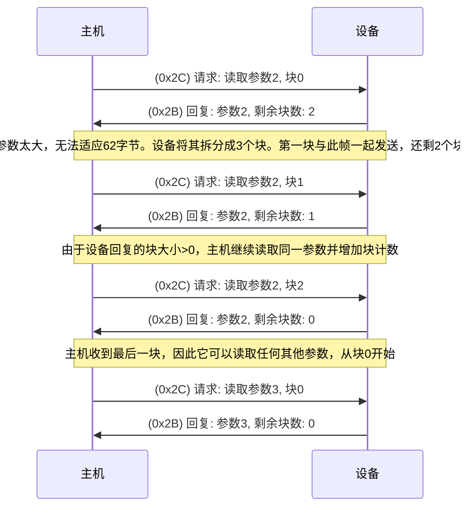
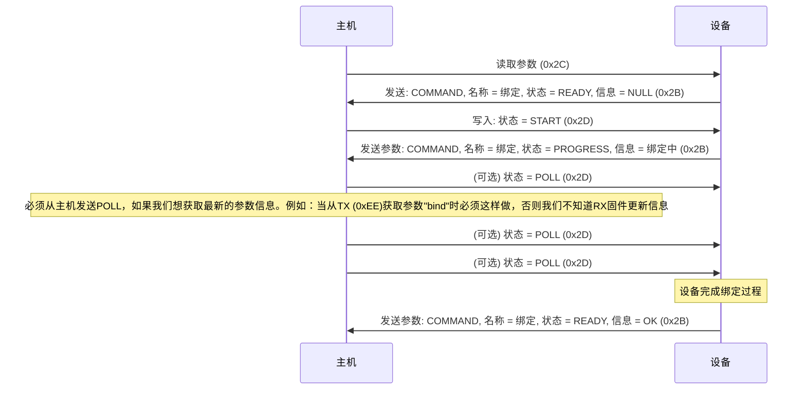
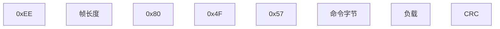
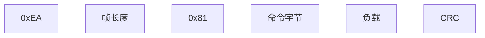

# CRSF协议

## 目录

- [CRSF协议](#crsf-protocol)
- [目录](#目录)
- [特性](#特性)
- [目的](#目的)
- [缩略词](#缩略词)
- [硬件](#硬件)
  - [单线半双工UART](#单线半双工uart)
  - [双线全双工UART](#双线全双工uart)
  - [多主机I2C(BST)](#多主机i2cbst)
- [帧构建](#帧构建)
  - [结构](#结构)
  - [广播帧](#广播帧)
  - [扩展头帧](#扩展头帧)
  - [帧详情](#帧详情)
- [路由](#路由)
- [CRC](#crc)
- [设备地址](#设备地址)
- [广播帧类型](#广播帧类型)
  - [0x02 GPS](#0x02-gps)
  - [0x03 GPS时间](#0x03-gps时间)
  - [0x06 GPS扩展](#0x06-gps扩展)
  - [0x07 气压高度计传感器](#0x07-气压高度计传感器)
  - [0x08 电池传感器](#0x08-电池传感器)
  - [0x09 气压高度与垂直速度](#0x09-气压高度与垂直速度)
  - [0x0A 空速](#0x0a-空速)
  - [0x0B 心跳](#0x0b-心跳)
  - [0x0C 转速](#0x0c-转速)
  - [0x0D 温度](#0x0d-温度)
  - [0x0E 电压](#0x0e-电压)
  - [0x0F 已废弃](#0x0f-已废弃)
  - [0x10 VTX遥测](#0x10-vtx遥测)
  - [0x11 气压计](#0x11-气压计)
  - [0x12 磁力计](#0x12-磁力计)
  - [0x13 加速度计/陀螺仪](#0x13-加速度计陀螺仪)
  - [0x14 链路统计](#0x14-链路统计)
  - [0x16 RC通道打包负载](#0x16-rc通道打包负载)
  - [0x17 RC通道子集打包](#0x17-rc通道子集打包)
  - [0x18 RC通道打包11位（未使用）](#0x18-rc通道打包11位未使用)
  - [0x19 - 0x1B 保留(Crossfire)](#0x19---0x1b-保留crossfire)
  - [0x1C 链路统计RX](#0x1c-链路统计rx)
  - [0x1D 链路统计TX](#0x1d-链路统计tx)
  - [0x1E 姿态](#0x1e-姿态)
  - [0x1F MAVLink飞控](#0x1f-mavlink飞控)
  - [0x21 飞行模式](#0x21-飞行模式)
  - [0x22 ESP_NOW消息](#0x22-esp_now消息)
  - [0x27 保留](#0x27-保留)
- [扩展帧类型](#扩展帧类型)
  - [0x28 参数Ping设备](#0x28-参数ping设备)
  - [0x29 参数设备信息](#0x29-参数设备信息)
  - [块](#块)
  - [0x2B 参数设置（条目）](#0x2b-参数设置条目)
    - [参数类型定义及隐藏位](#参数类型定义及隐藏位)
    - [超出范围](#超出范围)
    - [UINT8, INT8, UINT16, INT16, UINT32, INT32](#uint8-int8-uint16-int16-uint32-int32)
    - [FLOAT](#float)
    - [文本选择](#文本选择)
    - [字符串](#字符串)
    - [文件夹](#文件夹)
    - [信息](#信息)
    - [命令](#命令)
  - [0x2C 参数设置（读取）](#0x2c-参数设置读取)
  - [0x2D 参数值（写入）](#0x2d-参数值写入)
  - [0x32 直接命令](#0x32-直接命令)
    - [0x32.0xFF 命令确认](#0x320xff-命令确认)
    - [0x32.0x01 飞控命令](#0x320x01-飞控命令)
    - [0x32.0x03 蓝牙命令](#0x320x03-蓝牙命令)
    - [0x32.0x05 OSD命令](#0x320x05-osd命令)
    - [0x32.0x08 VTX命令](#0x320x08-vtx命令)
    - [0x32.0x09 LED](#0x320x09-led)
    - [0x32.0x0A 通用](#0x320x0a-通用)
    - [0x32.0x10 Crossfire](#0x320x10-crossfire)
    - [0x32.0x12 保留](#0x320x12-保留)
    - [0x32.0x20 流控制帧](#0x320x20-流控制帧)
    - [0x32.0x22 屏幕命令](#0x320x22-屏幕命令)
      - [0x32.0x22.0x01 弹出消息开始](#0x320x220x01-弹出消息开始)
      - [0x32.0x22.0x02 选择返回值](#0x320x220x02-选择返回值)
      - [0x32.0x22.0x03 保留](#0x320x220x03-保留)
      - [0x32.0x22.0x04 保留](#0x320x220x04-保留)
  - [0x34 日志](#0x34-日志)
  - [0x36 保留](#0x36-保留)
  - [0x38 保留](#0x38-保留)
  - [0x3A - 远程相关帧](#0x3a---远程相关帧)
    - [0x3A.0x01 - 0x3A.0x09 - 保留](#0x3a0x01---0x3a0x09---保留)
    - [0x3A.0x10 定时校正（CRSF Shot）](#0x3a0x10-定时校正crsf-shot)
  - [0x3C 游戏](#0x3c-游戏)
  - [0x3E 保留](#0x3e-保留)
  - [0x40 保留](#0x40-保留)
  - [0x78 - 0x79 KISSFC保留](#0x78---0x79-kissfc保留)
  - [0x7A MSP请求 / 0x7B 响应](#0x7a-msp请求--0x7b-响应)
  - [0x7F ArduPilot旧版保留](#0x7f-ardupilot旧版保留)
  - [0x80 ArduPilot保留透传帧](#0x80-ardupilot保留透传帧)
  - [0x81, 0x82 mLRS保留](#0x81-0x82-mlrs保留)
  - [0xAA CRSF MAVLink信封](#0xaa-crsf-mavlink信封)
  - [0xAC CRSF MAVLink系统状态传感器](#0xac-crsf-mavlink系统状态传感器)
- [文档结束](#文档结束)

## 特性

- 在遥控器-发射端和接收端-飞控之间具有低延迟高更新率的RC信号
- 双向通信
- 从飞行平台向遥控器分享遥测数据
- 编辑直连设备和远程连接设备的配置（遥控器可以通过CRSF配置飞控或OSD）
- 向发射端分享接收序列号，以便与模型记忆匹配。

## 目的

本文档作为公共的"单一真实来源"，由TBS维护，记录了该协议。它作为实现CRSF兼容设备的参考，也允许与TBS无关的开发人员提出需求并建议对现有协议的扩展。这将进一步确立CRSF作为RC设备中最广泛实施的现代通信协议的地位。

## 缩略词

- **CRSF** 用于无线电控制设备的二进制帧协议。这是本文档的主题。
- **RC** 遥控器。飞行员输入控制设备。
- **TX** 发射器（实际上是一个收发器）。通常作为RC的一部分（外部或内置为无线电模块）。
- **RX** 接收器（也是一个收发器）。可能是独立设备或与飞控或VTX集成。
- **FC** 飞行控制器。
- **VTX** 视频发射器。
- **VRX** 视频接收器。

## 硬件

### 单线半双工UART

这种配置通常用于RC和TX之间。在这种情况下，RC充当主设备，而TX在与RC发送的RC帧同步的情况下响应遥测数据。RC必须发送一个预配置或协商频率的帧，并将线路切换到高阻抗模式并等待来自TX的响应。

UART默认运行在 **400 kbaud 8N1** （反相或非反相）在 **3.3V** 电平，但也支持115.2 kbaud和更高（1Mbaud，2Mbaud）的波特率，具体取决于硬件（参见 [0x70 CRSF协议速度提案](#0x320x0a-通用)）。建议TX模块配置为相同的波特率，或者能够自动锁定到正确的波特率。最大帧速率必须根据波特率选择，以使RC和TX能够在一帧内发送最大长度（64字节）的帧。

### 双线全双工UART

这种配置通常用于飞行平台侧。两个设备通过常规UART连接连接。在此配置中仅支持非反相（常规）UART。UART默认运行在 **416666 波特率 8N1 3.0 到 3.3V 电平**，但波特率可以协商提高以减少延迟。

### 多主机I2C（BST）

（EOL）BST是一个多主机I2C总线。它在3.3V电平下以100kHz运行，使用7位地址。设备地址已经包含R/W位。这意味着列表中的每个设备的写地址和读地址是设备地址+1。每个支持BST的设备应在任何情况下释放SDA以不阻塞总线。建议监控心跳消息，如果有1.5秒超时则重置接口。需要支持一般调用帧，这些将在本文档中称为广播帧。

## 帧构建

### 结构

每个帧的基本结构都是相同的。有一系列带有扩展头的类型，其中有效载荷的前几个字节是标准化的。这是为了在多个设备之间路由帧以实现点对点通信。每个CRSF帧不超过**64字节**（包括同步和CRC字节）

### 广播帧


### 扩展头帧


### 帧详情

- **同步字节** 可能是以下之一（因此，接收设备应期待任何一个）：
  - 串口同步字节：**0xC8**；
  - 广播设备地址：**0x00**；
  - 设备地址（见下方地址）。
- **帧长度：** 帧中除同步字节和帧长度外的字节数（基本上是整个帧大小-2）
  - **广播帧：** 类型 + 负载 + CRC
  - **扩展头帧：** 类型 + 目标地址 + 源地址 + 负载 + CRC
  - 有效范围在2到62之间。如果此uint8值超出有效范围，则必须丢弃该帧。
- **类型：** 帧类型
- **字节序：** 大端序（MSB）

帧大小可能比给定类型的预期帧更大。这不应该成为计算帧无效的原因。帧接收方应该忽略多余的字段。有可能帧发送方支持较新版本的CRSF协议并在已知字段之后发送一些附加字段。

反之：如果帧有可选字段，有时这些字段可能被设置为空字段（例如零长度的空终止字符串），但有时这些字段可能不存在且帧大小缩短。不要尝试读取超过帧有效负载的可选字段。

## 路由

如果设备具有多个CRSF端口，则需要将接收到的所有帧转发到其他端口。CRSF作为星型网络工作，每个节点上都有固定的地址表。禁止使用任何环形连接，因为这样会无休止地继续转发相同的消息。

## CRC

CRC包括每个帧的类型和负载（不包括同步字节和帧长度）。

CRC8实现，多项式 = x7+ x6+ x4+ x2+ x0 (0xD5)

代码示例：

```cpp
unsigned char crc8tab[256] = {
    0x00, 0xD5, 0x7F, 0xAA, 0xFE, 0x2B, 0x81, 0x54, 0x29, 0xFC, 0x56, 0x83, 0xD7, 0x02, 0xA8, 0x7D,
    0x52, 0x87, 0x2D, 0xF8, 0xAC, 0x79, 0xD3, 0x06, 0x7B, 0xAE, 0x04, 0xD1, 0x85, 0x50, 0xFA, 0x2F,
    0xA4, 0x71, 0xDB, 0x0E, 0x5A, 0x8F, 0x25, 0xF0, 0x8D, 0x58, 0xF2, 0x27, 0x73, 0xA6, 0x0C, 0xD9,
    0xF6, 0x23, 0x89, 0x5C, 0x08, 0xDD, 0x77, 0xA2, 0xDF, 0x0A, 0xA0, 0x75, 0x21, 0xF4, 0x5E, 0x8B,
    0x9D, 0x48, 0xE2, 0x37, 0x63, 0xB6, 0x1C, 0xC9, 0xB4, 0x61, 0xCB, 0x1E, 0x4A, 0x9F, 0x35, 0xE0,
    0xCF, 0x1A, 0xB0, 0x65, 0x31, 0xE4, 0x4E, 0x9B, 0xE6, 0x33, 0x99, 0x4C, 0x18, 0xCD, 0x67, 0xB2,
    0x39, 0xEC, 0x46, 0x93, 0xC7, 0x12, 0xB8, 0x6D, 0x10, 0xC5, 0x6F, 0xBA, 0xEE, 0x3B, 0x91, 0x44,
    0x6B, 0xBE, 0x14, 0xC1, 0x95, 0x40, 0xEA, 0x3F, 0x42, 0x97, 0x3D, 0xE8, 0xBC, 0x69, 0xC3, 0x16,
    0xEF, 0x3A, 0x90, 0x45, 0x11, 0xC4, 0x6E, 0xBB, 0xC6, 0x13, 0xB9, 0x6C, 0x38, 0xED, 0x47, 0x92,
    0xBD, 0x68, 0xC2, 0x17, 0x43, 0x96, 0x3C, 0xE9, 0x94, 0x41, 0xEB, 0x3E, 0x6A, 0xBF, 0x15, 0xC0,
    0x4B, 0x9E, 0x34, 0xE1, 0xB5, 0x60, 0xCA, 0x1F, 0x62, 0xB7, 0x1D, 0xC8, 0x9C, 0x49, 0xE3, 0x36,
    0x19, 0xCC, 0x66, 0xB3, 0xE7, 0x32, 0x98, 0x4D, 0x30, 0xE5, 0x4F, 0x9A, 0xCE, 0x1B, 0xB1, 0x64,
    0x72, 0xA7, 0x0D, 0xD8, 0x8C, 0x59, 0xF3, 0x26, 0x5B, 0x8E, 0x24, 0xF1, 0xA5, 0x70, 0xDA, 0x0F,
    0x20, 0xF5, 0x5F, 0x8A, 0xDE, 0x0B, 0xA1, 0x74, 0x09, 0xDC, 0x76, 0xA3, 0xF7, 0x22, 0x88, 0x5D,
    0xD6, 0x03, 0xA9, 0x7C, 0x28, 0xFD, 0x57, 0x82, 0xFF, 0x2A, 0x80, 0x55, 0x01, 0xD4, 0x7E, 0xAB,
    0x84, 0x51, 0xFB, 0x2E, 0x7A, 0xAF, 0x05, 0xD0, 0xAD, 0x78, 0xD2, 0x07, 0x53, 0x86, 0x2C, 0xF9};

uint8_t crc8(const uint8_t * ptr, uint8_t len)
{
    uint8_t crc = 0;
    for (uint8_t i=0; i<len; i++)
        crc = crc8tab[crc ^ *ptr++];
    return crc;
}
```

## 设备地址

- **0x00** 广播地址
- **0x0E** 云端
- **0x10** USB设备
- **0x12** 蓝牙模块/ WiFi
- **0x13** WiFi接收器（移动游戏/模拟器）
- **0x14** 视频接收器
- _0x20-0x7F NAT动态地址空间_
- **0x80** OSD / TBS CORE PNP PRO
- **0x90** ESC 1
- **0x91** ESC 2
- **0x92** ESC 3
- **0x93** ESC 4
- **0x94** ESC 5
- **0x95** ESC 6
- **0x96** ESC 7
- **0x97** ESC 8
- _0x8A 保留_
- _0xB0 Crossfire保留_
- _0xB2 Crossfire保留_
- **0xC0** 电压/电流传感器 / PNP PRO数字电流传感器
- **0xC2** GPS / PNP PRO GPS
- **0xC4** TBS黑盒
- **0xC8** 飞行控制器
- _0xCA 保留_
- **0xCC** 赛车标签
- **0xCE** VTX
- **0xEA** 遥控器
- **0xEC** RC接收器 / Crossfire Rx
- **0xEE** RC发射器模块 / Crossfire Tx
- _0xF0 保留_
- _0xF2 保留_

## 广播帧类型

类型低于0x27的帧是广播帧，具有简单（短）头部。

### 0x02 GPS

```cpp
    int32_t 纬度;       // 度 / 10`000`000
    int32_t 经度;      // 度 / 10`000`000
    uint16_t 地面速度;   // 公里/小时 / 100
    uint16_t 航向;       // 度 / 100
    uint16_t 海拔;      // 米 - 1000米偏移
    uint8_t 卫星数;     // 可见卫星数量
```

### 0x03 GPS 时间

此帧用于与ublox时间脉冲同步。时间的最大偏移量为±10ms。

```cpp
    int16_t 年;
    uint8_t 月;
    uint8_t 日;
    uint8_t 时;
    uint8_t 分;
    uint8_t 秒;
    uint16_t 毫秒;
```

### 0x06 GPS 扩展

```cpp
    uint8_t fix_type;       // 当前GPS定位质量
    int16_t n_speed;        // 北向（北为正）速度 [cm/sec]
    int16_t e_speed;        // 东向（东为正）速度 [cm/sec]
    int16_t v_speed;        // 垂直方向（向上为正）速度 [cm/sec]
    int16_t h_speed_acc;    // 水平速度精度 cm/sec
    int16_t track_acc;      // 航向精度，单位为度（乘以10）
    int16_t alt_ellipsoid;  // GPS椭球上方高度（非海平面）米
    int16_t h_acc;          // 水平精度 cm
    int16_t v_acc;          // 垂直精度 cm
    uint8_t 保留;
    uint8_t hDOP;           // 水平精度因子，单位0.1
    uint8_t vDOP;           // 垂直精度因子，单位0.1
```

### 0x07 气压高度计传感器

```cpp
    int16_t v_speed;        // 垂直速度 cm/s
```

### 0x08 电池传感器

```cpp
    int16_t 电压;        // 电压 (LSB = 10 µV)
    int16_t 电流;        // 电流 (LSB = 10 µA)
    uint24_t 已用容量; // 容量使用 (mAh)
    uint8_t 剩余电量;      // 电池剩余 (百分比)
```

### 0x09 气压高度与垂直速度

这些帧允许以位效率的方式发送高度和垂直速度。它允许在3字节中结合分米精度的高度和32公里范围以及3厘米/秒精度的垂直速度和25米/秒范围。

```cpp
    uint16_t 高度打包;       // 相对于起始点（校准点）的高度
                                    // 详见下面说明。
    int8_t   垂直速度打包; // 垂直速度。详见下面说明。
```

高度值取决于MSB（第15位）：

- MSB = 0：高度单位为分米 - 10000dm偏移（所以0表示-1000m；10000表示0m（起始高度）；0x7fff表示2276.7m）；
- MSB = 1：高度单位为米。没有任何偏移。

高度打包/解包函数示例：

```cpp
int32_t get_altitude_dm(uint16_t packed){
    return (packed & 0x8000) ? (packed & 0x7fff) * 10 : (packed - 10000);
}

// 由于OpenTX将任何0xFFFF值视为错误，
// 最大发送值限制为0xFFFE（32766米）
//打包函数示例：
uint16_t get_altitude_packed (int32_t altitude_dm){
    enum
    {
        ALT_MIN_DM = 10000,                     //最小高度（分米）
        ALT_THRESHOLD_DM = 0x8000 - ALT_MIN_DM, //高度精度
                                                // 改变（分米）
        ALT_MAX_DM = 0x7ffe * 10 - 5,           //最大高度（分米）
    }

    if(altitude_dm < -ALT_MIN_DM)               //小于最小高度
        return 0;                               //最小值
    if(altitude_dm > ALT_MAX_DM)                //大于最大值
        return 0xfffe;                          //最大值
    if(altitude_dm < ALT_THRESHOLD_DM)          //分米分辨率范围
        return altitude_dm + ALT_MIN_DM;
    return ((altitude_dm + 5) / 10) | 0x8000;   //米分辨率范围
}
```

垂直速度用cm/s表示，采用对数刻度，打包/解包函数为：

```cpp
const int   Kl = 100;       // 线性常数;
const float Kr = .026;      // 范围常数;

int8_t  get_vertical_speed_packed (int16 vertical_speed_cm_s){
    return (int8_t)(log(abs(vertical_speed_cm_s)/Kl + 1)/Kr)
                                 * sign(vertical_speed_cm_s);
}

int16_t get_vertical_speed_cm_s (int8_t vertical_speed_packed){
    return (exp(abs(vertical_speed_packed * Kr)) - 1) * Kl
                           * sign(vertical_speed_packed);
}

```

这样的常数提供了±2500cm/s的范围，在低速时精度为3cm/s，在约25m/s的速度时精度为70cm/s;

### 0x0A 空速

```cpp
    uint16_t 速度;             // 空速，单位0.1 * km/h (百米/小时)
```

### 0x0B 心跳

```cpp
    int16_t 源地址;             // 源设备地址
```

### 0x0C 转速

帧类型用于从飞机向发射机传输RPM（每分钟转数）遥测数据。此帧可用于报告电机或螺旋桨RPM以进行性能监控或诊断。

```cpp
    uint8_t    rpm_source_id;  // 识别RPM数据的来源（例如，0 = 电机1，1 = 电机2等）
    int24_t    rpm_value[];      // 1 - 19个RPM值，负值表示电机反转
```

### 0x0D 温度

帧类型用于从车辆向发射机传输温度遥测数据。此帧可用于报告车辆上各种来源的温度读数，如电机、电子调速器或环境温度。

```cpp
    uint8_t     temp_source_id;       // 识别温度数据的来源（例如，0 = FC包括所有ESC等，1 = 环境温度等）
    int16_t     temperature[];        // 最多20个温度值，单位为十分之一摄氏度（例如，250 = 25.0°C，-50 = -5.0°C）
```

### 0x0E 电压（或"电压组"）

用于从飞机向发射机传输电压遥测数据。可用于报告电池单体电压或单个来源的相关电压组。

对电压类型的解释取决于所选的source_id：
- 0..127: 解释为单个电池的单体电压，最多29S。多个电池可以使用不同的source_id的多个0x0E帧来报告。例如，0 = 电池1单体，1 = 电池2单体，等等，
- 128..255: 解释为来自单个来源的一般电压。例如，ESC可以将输入电压、BEC输出电压和MCU电压作为一个source_id报告，并使用其他source_id报告多个ESC。例如，128 = ESC 1，129 = ESC 2，等等

```cpp
    uint8_t     Voltage_source_id;  // 电压来源
    uint16_t    Voltage_values[];   // 最多29个电压，单位毫伏（例如3.850V = 3850）
```

### 0x0F 已废弃

### 0x10 VTX遥测

```cpp
    uint8_t     源地址;
    uint8_t     功率_dBm;          // VTX功率，单位dBm
    uint16_t    频率_MHz;      // VTX频率，单位MHz
    uint8_t     pit_mode:1;         // 0=关闭，1=开启
    uint8_t     pitmode_control:2;  // 0=关闭，1=开启，2=切换，3=失效保护
    uint8_t     pitmode_switch:4;   // 0=Ch5，1=Ch5反相，…，15=Ch12反相
```

### 0x11 气压计

```cpp
  int32_t     pressure_pa;        // 帕斯卡
  int32_t     baro_temp;          // 百分之一度
```

### 0x12 磁力计

```cpp
  int16_t     field_x;            // 毫高斯 * 3
  int16_t     field_y;            // 毫高斯 * 3
  int16_t     field_z;            // 毫高斯 * 3
```

### 0x13 加速度计陀螺仪

NEU机身坐标系下的原始加速度计和陀螺仪数据，样本是在采样间隔内平均的原始数据

加速度计：+X轴 = 前进
       +Y轴 = 右
       +Z轴 = 上
陀螺仪：  +X轴 = 左滚
       +Y轴 = 俯仰向上
       +Z轴 = 顺时针偏航

```cpp
    uint32_t sample_time;       // 采样时间戳，单位微秒
    int16_t gyro_x;             // LSB = INT16_MAX/2000 DPS
    int16_t gyro_y;             // LSB = INT16_MAX/2000 DPS
    int16_t gyro_z;             // LSB = INT16_MAX/2000 DPS
    int16_t acc_x;              // LSB = INT16_MAX/16 G
    int16_t acc_y;              // LSB = INT16_MAX/16 G
    int16_t acc_z;              // LSB = INT16_MAX/16 G
    int16_t gyro_temp;          // 百分之一度
```

### 0x14 链路统计

上行链路是从地面到无人机的连接，下行链路则是相反方向

```cpp
    uint8_t     up_rssi_ant1;       // 上行RSSI天线1 (dBm * -1)
    uint8_t     up_rssi_ant2;       // 上行RSSI天线2 (dBm * -1)
    uint8_t     up_link_quality;    // 上行包成功率/链路质量 (%)
    int8_t      up_snr;             // 上行SNR (dB)
    uint8_t     active_antenna;     // 当前最佳天线编号
    uint8_t     rf_profile;         // 枚举 {4fps = 0 , 50fps, 150fps}
    uint8_t     up_rf_power;        // 枚举 {0mW = 0, 10mW, 25mW, 100mW,
                                    // 500mW, 1000mW, 2000mW, 250mW, 50mW}
    uint8_t     down_rssi;          // 下行RSSI (dBm * -1)
    uint8_t     down_link_quality;  // 下行包成功率/链路质量 (%)
    int8_t      down_snr;           // 下行SNR (dB)
```

### 0x16 RC通道打包负载

16个通道打包成22字节。如果发生故障保护，此帧将不再发送（当故障保护类型设置为"切断"时）。建议在启动FC故障保护程序之前等待1秒。

```cpp
#define TICKS_TO_US(x)  ((x - 992) * 5 / 8 + 1500)
#define US_TO_TICKS(x)  ((x - 1500) * 8 / 5 + 992)

// 中心 (1500µs) = 992

struct
{
    int channel_01: 11;
    int channel_02: 11;
    int channel_03: 11;
    int channel_04: 11;
    int channel_05: 11;
    int channel_06: 11;
    int channel_07: 11;
    int channel_08: 11;
    int channel_09: 11;
    int channel_10: 11;
    int channel_11: 11;
    int channel_12: 11;
    int channel_13: 11;
    int channel_14: 11;
    int channel_15: 11;
    int channel_16: 11;
};
```

### 0x17 RC通道子集打包

> [!警告]
> 不推荐实现此帧。正在修订中。

```cpp
// 将rc值转换为通道值的计算示例
#define PACK_TX(x)          ((x - 3750) * 8 / 25 + 993)
#define UNPACK_RX(x, S)     (x * S + 988)
// S = 1.0 表示 10 位，S = 0.5 表示 11 位，S = 0.25 表示 12 位，S = 0.125 表示 13 位

struct PACKED
{
    uint8_t     starting_channel:5;             // 帧中的第一个通道号
    uint8_t     res_configuration:2;            // RC 数据分辨率的配置
                                                // (10 - 13 位)
    uint8_t     digital_switch_flag:1;          // 数字通道的配置位
    uint16_t    channel[]:resolution;           // 可变数量的通道
                                                // (基于 res_configuration 的可变分辨率)
                                                // 基于帧大小
    uint16_t    digital_switch_channel[]:10;    // 数字开关通道
};
```

### 0x18 RC通道打包11位（未使用）

与0x16相同，但使用与0x17相同的转换样式

### 0x19 - 0x1B 保留Crossfire

### 0x1C 链路统计RX

```cpp
    uint8_t rssi_db;        // RSSI (dBm * -1)
    uint8_t rssi_percent;   // RSSI 百分比
    uint8_t link_quality;   // 包成功率 / 链路质量 (%)
    int8_t  snr;            // SNR (dB)
    uint8_t rf_power_db;    // rf 功率 dBm
```

### 0x1D 链路统计TX

```cpp
    uint8_t rssi_db;        // RSSI (dBm * -1)
    uint8_t rssi_percent;   // RSSI 百分比
    uint8_t link_quality;   // 包成功率 / 链路质量 (%)
    int8_t  snr;            // SNR (dB)
    uint8_t rf_power_db;    // rf 功率 dBm
    uint8_t fps;            // rf 每秒帧数 (fps / 10)
```

### 0x1E 姿态

> [!警告]
> 角度值必须在-180°至+180°范围内！

```cpp
    int16_t pitch;  // 俯仰角 (LSB = 100 µrad)
    int16_t roll;   // 滚转角  (LSB = 100 µrad)
    int16_t yaw;    // 偏航角   (LSB = 100 µrad)
```

### 0x1F MAVLink FC

```cpp
    int16_t     airspeed;
    uint8_t     base_mode;      // 车辆模式标志，定义在MAV_MODE_FLAG枚举中
    uint32_t    custom_mode;    // 自动驾驶仪特定标志
    uint8_t     autopilot_type; // FC类型；定义在MAV_AUTOPILOT枚举中
    uint8_t     firmware_type;  // 车辆类型；定义在MAV_TYPE枚举中
```

**官方MAVLink文档：**

- [MAV_MODE_FLAG枚举](https://mavlink.io/en/messages/common.html#MAV_MODE_FLAG)
- [MAV_AUTOPILOT枚举](https://mavlink.io/en/messages/common.html#MAV_AUTOPILOT)
- [MAV_TYPE枚举](https://mavlink.io/en/messages/common.html#MAV_TYPE)

### 0x21 飞行模式

```cpp
    char[]  飞行模式  // 空终止字符串
```

### 0x22 ESP_NOW消息

```cpp
    uint8_t VAL1;           // 用于飞行员座位位置
    uint8_t VAL2;           // 用于当前飞行员圈数
    char    VAL3[15];       // 15个字符用于当前/分割圈时间
    char    VAL4[15];       // 15个字符用于当前/分割圈时间
    char    FREE_TEXT[20];  // 屏幕底部的20个字符自由文本
```

### 0x27 保留

## 扩展帧类型

类型为0x28及以上（明确提到的除外）的帧具有扩展头（带目标和源）。

### 0x28 参数Ping设备

主机可以ping特定设备（设备的目标节点地址）或所有设备（目标节点地址0x00广播地址），它们将回复[参数设备信息帧](#0x29-参数设备信息)。该帧没有有效载荷。

### 0x29 参数设备信息

```cpp
    char[]      设备名称;        // 空终止字符串
    uint32_t    序列号;
    uint32_t    硬件ID;
    uint32_t    固件ID;
    uint8_t     参数总数;   // 参数总数
    uint8_t     参数版本号;
```

### 块

最大CRSF帧大小为64字节（包括同步字节和CRC）。主机应始终默认读取([0x2C 参数设置(读取)](#0x2c-参数设置读取))块号0。如果读取参数([0x2B 参数设置(条目)](#0x2b-参数设置条目))适合最大大小，它将在参数帧中用块剩余数0进行回复。否则，它将发送还有多少块需要读取。

**参数设置帧(0x2B和0x2C)链的示例：**



**块帧的有效载荷具有以下结构：**

```cpp
uint8_t Parameter_number;                           // 从0开始
uint8_t Parameter_chunks_remaining;                 // 剩余块数
        Parameter settings (entry) payload的部分. // 最多56字节
```

### 0x2B 参数设置（条目）

这是设备（节点地址）如何与其他设备共享参数的方法。参见[块](#块)

> [!注意]
> 如果Data_type_payload_chunk <= 56，可以在1帧中发送，否则有效载荷将分成2帧或多帧。

> [!注意]
> 0x2B `Parameter_number` 0 是特殊的。
> 它定义设备的根文件夹结构，因此0x2B有效载荷`data_type`必须是**0x0B FOLDER**
>
> 建议的**0x0B FOLDER**有效载荷`Name`是"ROOT"（0x52 0x4F 0x4F 0x54 0x00）。
>
> 如果DEVICE对`Parameter_number` = 0请求没有响应，意味着其固件CRSF实现不支持根文件夹结构。在这种情况下HOST应从1开始请求参数，直到在**0x29 Parameter Device Information**中作为`Parameters_total`传输的最后一个参数

```cpp
    uint8_t         Sync_byte;                  // 0xc8
    uint8_t         Frame_length;
    uint8_t         Frame_type;                 // 0x2b = Parameter settings (entry)
    uint8_t         Destination_address;        // 0xea = RC
    uint8_t         Origin_address;             // 0xee = TX
    uint8_t         Parameter_number;           // 从0开始
    uint8_t         Parameter_chunks_remaining; // 剩余块数
    {
        Data_type_payload_chunk;                // 请参阅下面每种类型的负载
    }
    uint8_t         CRC_8;                      // 帧CRC（参见CRC主题）
```

### 参数类型定义和隐藏位

参数类型为8位宽。第7位表示参数是否隐藏（1 = 隐藏 / 0 = 可见）。这使得可以根据其他参数动态显示或隐藏参数。第6-0位保存参数信息的类型（枚举data_type）。

```cpp
enum data_type
{
    UINT8           = 0,  // 0x00 // 已弃用
    INT8            = 1,  // 0x01 // 已弃用
    UINT16          = 2,  // 0x02 // 已弃用
    INT16           = 3,  // 0x03 // 已弃用
    UINT32          = 4,  // 0x04 // 已弃用
    INT32           = 5,  // 0x05 // 已弃用
    FLOAT           = 8,  // 0x08
    TEXT_SELECTION  = 9,  // 0x09
    STRING          = 10, // 0x0A
    FOLDER          = 11, // 0x0B
    INFO            = 12, // 0x0C
    COMMAND         = 13, // 0x0D
    OUT_OF_RANGE    = 127 //
}
```

### 超出范围

如果请求的参数号超出了设备参数范围，将发送此类型。它也将作为参数列表的最后一个参数发送到让主机知道参数设置列表读取请求的末尾。

### UINT8, INT8, UINT16, INT16, UINT32, INT32

建议弃用。这些目前通过FLOAT实现，更为通用。

### FLOAT

值、最小值、最大值和默认值以INT32形式发送。小数点值告诉值后面有多少位小数。步长是推荐的增量或减量值。

**浮点负载**

```cpp
    uint8_t         Parent_folder;              // 父文件夹的参数号，
                                                // 0表示根文件夹
    enum data_type  Data_type;                  // 0x08 = float
    char[]          Name;                       // 空终止字符串
    int32_t         Value;
    int32_t         Min;
    int32_t         Max;
    int32_t         Default;
    uint8_t         Decimal_point;
    int32_t         Step_size;
    char[]          Unit;                       // 空终止测量单位字符串
```

### 文本选择

此条目的值部分分为两部分。第一部分是所有可能的文本格式值的char数组。它们由分号（;）分隔，数组最后以空结尾。第二部分是uint8_t变量的当前值。最小值、最大值和默认值表示为uint8_t数字，其中0代表第一个文本。要修改此参数，只需要发送新值的uint8_t值。

**文本选择负载**

```cpp
    uint8_t         Parent folder;              // 父文件夹的参数号，
                                                // 0表示根文件夹
    enum data_type  Data type;                  // 0x09 = text selection
    char[]          Name;                       // 空终止字符串
    char[]          Options;                    // 空终止字符串，字符串是
                                                // 以分号分隔的值列表
    uint8_t         Value;
    uint8_t         Min;
    uint8_t         Max;
    uint8_t         Default;
    char[]          Unit;                       // 空终止字符串
```

### 字符串

这种类型用于文本修改。只会传输当前文本。此类型不会发送min、max和default条目。

**字符串负载**

```cpp
    uint8_t         Parent_folder;              // 父文件夹的参数号，
                                                // 0表示根文件夹
    enum data_type  Data_type;                  // 0x0a = string
    char[]          Name;                       // 空终止字符串
    char[]          Value;                      // 空终止字符串
    uint8_t         String_max_length;          // 仅用于字符串类型
```

### 文件夹

文件夹用于使参数结构更清晰。每个参数都有一个父项，参数可以链接到父文件夹。此外，文件夹将提供其子项的列表并附加文件夹名称。列表的末尾用0xFF字节标记。列表将保存子项的参数号。

**文件夹负载**

```cpp
    uint8_t         Parent_folder;              // 父文件夹的参数号，
                                                // 0表示根文件夹
    enum data_type  Data_type;                  // 0x0b = folder
    char[]          Name;                       // 空终止字符串
    uint8_t[]       List_of_children;           // 用0xFF条目标记列表末尾
```

### 信息

值是一个空终止字符串。与STRING相同，除了INFO条目不能被修改且不包含最大长度。

**信息负载**

```cpp
    uint8_t         Parent_folder;              // 父文件夹的参数号，
                                                // 0表示根文件夹
    enum data_type  Data_type;                  // 0x0c = info
    char[]          Name;                       // 空终止字符串
    char[]          Info;                       // 空终止字符串
```

### 命令

使用命令类型，主机能够在设备上运行/执行功能。这可以是任何东西：链接绑定crossfire，校准陀螺仪/加速度计等。

设备默认状态为READY。一旦主机想要执行功能，它就会写入参数并设置为START状态。根据功能的不同，设备会切换到PROGRESS、CONFIRMATION_NEEDED或READY状态。

当设备发送CONFIRMATION_NEEDED时，主机会显示一个带有"确认"或"取消"选项的确认框。如果用户选择其中一个，选择将被传输到设备并继续执行功能。通过Info字段，设备可以向主机发送额外信息。

如果主机发送状态为POLL，它将强制设备发送0x2B参数设置（条目）的更新状态。

**命令负载**

```cpp
struct
{
    uint8_t         Parent_folder;  // 父文件夹的参数号，0表示根文件夹
    enum data_type  Data_type;      // 0x0d = command
    char[]          Name;           // 空终止字符串
    enum cmd_status Status;         // uint8_t
    uint8_t         Timeout;        // ms * 100
    char[]          Info;           // 空终止字符串
}

enum cmd_status
{
    READY               = 0, //--> 反馈
    START               = 1, //<-- 输入
    PROGRESS            = 2, //--> 反馈
    CONFIRMATION_NEEDED = 3, //--> 反馈
    CONFIRM             = 4, //<-- 输入
    CANCEL              = 5, //<-- 输入
    POLL                = 6  //<-- 输入
}
```

**命令链示例**



### 0x2C 参数设置（读取）

请求特定参数。此命令用于重新请求未成功通过链接的参数/块。

```cpp
    uint8_t Parameter_number;
    uint8_t Parameter_chunk_number; // 请求的块号，从0开始
```

### 0x2D 参数值（写入）

此命令用于向参数写入新值。主机发送包含参数号和新数据负载的`0x2D`帧。目标节点**必须**回复确认写入；然而，响应格式取决于参数的类型。

| 类型    | 名称               |
| ------- | ------------------ |
| uint8_t | Parameter_number   |
|         | Data               | // 新值负载；大小取决于数据类型

**响应行为：**

- **对于[FLOAT](file://d:\Yumud\core\utils\Variant.hpp#L21-L21)、`TEXT_SELECTION`和`STRING`类型：**
  设备通过回复**`Parameter value (0x2D)`**帧来确认写入。此响应包含相同的`Parameter_number`和刚刚接受的新`Data`负载。这作为新值已设置的验证。

- **对于[COMMAND](file://d:\Yumud\robots\vendor\robstride\robstride_primitive.hpp#L106-L106)类型：**
  [COMMAND](file://d:\Yumud\robots\vendor\robstride\robstride_primitive.hpp#L106-L106)写入的响应是**`Parameter settings (entry) (0x2B)`**帧。这是因为命令是有状态的。响应提供完整的命令参数定义，更新后的执行`Status`（例如`PROGRESS`、`CONFIRMATION_NEEDED`、`READY`）和任何相关[Info](file://d:\Yumud\middlewares\protocols\crsf\crsf_primitive.hpp#L48-L48)文本。这允许主机向用户显示反馈。有关状态生命周期的详细信息，请参阅[COMMAND](file://d:\Yumud\robots\vendor\robstride\robstride_primitive.hpp#L106-L106)类型定义。

> [!注意]
> 关键区别在于响应帧类型。对于简单值更改，响应是仅值验证帧（`0x2D`）。对于命令，响应是完整的参数定义帧（`0x2B`）以提供详细的反馈。`TEXT_SELECTION`的数据负载大小为1字节（新索引），[FLOAT](file://d:\Yumud\core\utils\Variant.hpp#L21-L21)的数据负载大小为4字节（新的int32_t值）。

## 0x32 直接命令

命令帧

```cpp
    uint8_t     Command_ID;
    uint8_t[]   Payload;        // 取决于Command ID
    uint8_t     Command_CRC8;   // 8位CRC多项式 = 0xBA
```

命令帧在其负载末尾受到额外CRC的保护。CRC包括帧类型（字节0x32）、目标、源、命令ID和每个命令帧的负载。

Command_CRC8实现，多项式 = x7+ x5+ x4+ x3+ x1 (0xBA)

> [!注意]
> 多项式与主要CRSF帧CRC不同。

> [!注意]
> 命令CRC不排除每个CRSF帧末尾的CRC。您还需要为整个帧包含末尾的CRC

```cpp
unsigned char command_crc8tab[256] = {
    0x00, 0xBA, 0xCE, 0x74, 0x26, 0x9C, 0xE8, 0x52, 0x4C, 0xF6, 0x82, 0x38, 0x6A, 0xD0, 0xA4, 0x1E,
    0x98, 0x22, 0x56, 0xEC, 0xBE, 0x04, 0x70, 0xCA, 0xD4, 0x6E, 0x1A, 0xA0, 0xF2, 0x48, 0x3C, 0x86,
    0x8A, 0x30, 0x44, 0xFE, 0xAC, 0x16, 0x62, 0xD8, 0xC6, 0x7C, 0x08, 0xB2, 0xE0, 0x5A, 0x2E, 0x94,
    0x12, 0xA8, 0xDC, 0x66, 0x34, 0x8E, 0xFA, 0x40, 0x5E, 0xE4, 0x90, 0x2A, 0x78, 0xC2, 0xB6, 0x0C,
    0xAE, 0x14, 0x60, 0xDA, 0x88, 0x32, 0x46, 0xFC, 0xE2, 0x58, 0x2C, 0x96, 0xC4, 0x7E, 0x0A, 0xB0,
    0x36, 0x8C, 0xF8, 0x42, 0x10, 0xAA, 0xDE, 0x64, 0x7A, 0xC0, 0xB4, 0x0E, 0x5C, 0xE6, 0x92, 0x28,
    0x24, 0x9E, 0xEA, 0x50, 0x02, 0xB8, 0xCC, 0x76, 0x68, 0xD2, 0xA6, 0x1C, 0x4E, 0xF4, 0x80, 0x3A,
    0xBC, 0x06, 0x72, 0xC8, 0x9A, 0x20, 0x54, 0xEE, 0xF0, 0x4A, 0x3E, 0x84, 0xD6, 0x6C, 0x18, 0xA2,
    0xE6, 0x5C, 0x28, 0x92, 0xC0, 0x7A, 0x0E, 0xB4, 0xAA, 0x10, 0x64, 0xDE, 0x8C, 0x36, 0x42, 0xF8,
    0x7E, 0xC4, 0xB0, 0x0A, 0x58, 0xE2, 0x96, 0x2C, 0x32, 0x88, 0xFC, 0x46, 0x14, 0xAE, 0xDA, 0x60,
    0x6C, 0xD6, 0xA2, 0x18, 0x4A, 0xF0, 0x84, 0x3E, 0x20, 0x9A, 0xEE, 0x54, 0x06, 0xBC, 0xC8, 0x72,
    0xF4, 0x4E, 0x3A, 0x80, 0xD2, 0x68, 0x1C, 0xA6, 0xB8, 0x02, 0x76, 0xCC, 0x9E, 0x24, 0x50, 0xEA,
    0x48, 0xF2, 0x86, 0x3C, 0x6E, 0xD4, 0xA0, 0x1A, 0x04, 0xBE, 0xCA, 0x70, 0x22, 0x98, 0xEC, 0x56,
    0xD0, 0x6A, 0x1E, 0xA4, 0xF6, 0x4C, 0x38, 0x82, 0x9C, 0x26, 0x52, 0xE8, 0xBA, 0x00, 0x74, 0xCE,
    0xC2, 0x78, 0x0C, 0xB6, 0xE4, 0x5E, 0x2A, 0x90, 0x8E, 0x34, 0x40, 0xFA, 0xA8, 0x12, 0x66, 0xDC,
    0x5A, 0xE0, 0x94, 0x2E, 0x7C, 0xC6, 0xB2, 0x08, 0x16, 0xAC, 0xD8, 0x62, 0x30, 0x8A, 0xFE, 0x44};
```

### 0x32.0xFF 命令确认

```cpp
    uint8_t Command_ID;;
    uint8_t SubCommand_ID;
    uint8_t Action;
        // 1 表示目标已采取行动
        // 0 表示命令不正确或该命令上没有功能
    uint8_t[] or char[] Information; // 空终止字符串
```

### 0x32.0x01 FC命令

```cpp
- 0x01 强制停机
- 0x02 缩放通道
```

### 0x32.0x03 蓝牙命令

```cpp
- 0x01 重置
- 0x02 启用
  - uint8_t Enable (0 = 禁用, 1 = 启用)
- 0x64 回声
```

### 0x32.0x05 OSD命令

```cpp
- 0x01 发送按钮:
  - uint8_t Buttons 按位 (位7=确定, 6=上, 5=下, 4=左, 3=右)
```

### 0x32.0x08 VTX命令

```cpp
- 0x01 已弃用 VTX 更改频道
  - EVO, PRO32 HV, PRO32 NANO 仍支持此功能。
- 0x02 设置频率
  - uint16_t 频率 (5000 - 6000 MHz)
- 0x03 已弃用 VTX 更改功率（移到0x08）
- 0x04 开启PitMode（上电时）
  - uint8_t PitMode:1 枚举 (0 = 关闭, 1 = 开启)
  - uint8_t pitmode_control:2; (0=关闭, 1=开启, 2=激活, 3=失效保护)
  - uint8_t pitmode_switch:4; (0=Ch5, 1=Ch5反向, … , 15=Ch12反向)
- 0x05 从PitMode唤醒（纯命令）
- 0x06 设置动态功率 (2020年5月15日在EVO, PRO32 HV, PRO32 NANO中)
    注意：需以1Hz频率发送。如果3秒内未收到，VTX
          将恢复到"0x08 设置功率"的功率设置
  - uint8_t 功率 (dBm) (0dBm可视为PitMode功率)
- 0x08 设置功率
  - uint8_t 功率 (dBm) (0dBm可视为PitMode功率)
```

### 0x32.0x09 LED

```cpp
- 0x01 恢复默认设置（还原到目标特定设置）
- 0x02 覆盖LED颜色（打包）
  - 9位H (0-359°)
  - 7位S (0-100%)
  - 8位V (0-100%)
- 0x03 覆盖脉冲（打包）
  - uint16 持续时间（从起始颜色到停止颜色的毫秒数）
  - 9位H_起始 (0-359°)
  - 7位S_起始 (0-100%)
  - 8位V_起始 (0-100%)
  - 9位H_停止 (0-359°)
  - 7位S_停止 (0-100%)
  - 8位V_停止 (0-100%)
- 0x04 覆盖闪烁（打包）
  - uint16 间隔
  - 9位H_起始 (0-359°)
  - 7位S_起始 (0-100%)
  - 8位V_起始 (0-100%)
  - 9位H_停止 (0-359°)
  - 7位S_停止 (0-100%)
  - 8位V_停止 (0-100%)
- 0x05 覆盖偏移（打包）
  - uint16 间隔
  - 9位H (0-359°)
  - 7位S (0-100%)
  - 8位V (0-100%)
```

### 0x32.0x0A 通用

```cpp
- 0x04 - 0x61 保留
- 0x70 CRSF协议速度提议
  - uint8_t 端口号
  - uint32  建议的波特率
- 0x71 CRSF协议速度提议响应
  - uint8_t 端口号
  - bool    响应 // (1 = 接受 / 0 = 拒绝)
```

### 0x32.0x10 Crossfire

```cpp
- 0x01 将接收器设为绑定模式
- 0x02 取消绑定模式
- 0x03 设置绑定ID
- 0x05 模型选择（选择模型/接收器的命令）
  - uint8_t 模型编号
- 0x06 当前模型选择（当前选择的查询帧）
- 0x07 回复当前模型选择（当前选择的回复帧）
  - uint8_t 模型编号
- 0x08 保留
- 0x09 保留
```

### 0x32.0x12 保留

### 0x32.0x20 流控制帧

设备可以限制数据速率或订阅特定帧。

```cpp
- 0x01 订阅
  - uint8_t  帧类型
  - uint16_t 最大间隔时间 // 毫秒
- 0x02 取消订阅
  - uint8_t  帧类型
```

### 0x32.0x22 屏幕命令

适用于所有带LCD屏幕的设备

#### 0x32.0x22.0x01 弹出消息开始

```cpp
    char[]  标题;                 // 空终止字符串
    char[]  信息消息;           // 空终止字符串
    uint8_t 最大超时间隔;   // 秒为单位的时间
    bool    关闭按钮选项;
    struct                          // 可选字段。如果其第一个字节为空
                                    // （selectionText为空）
                                    // 那么它只有1字节（空）长。
    {
        char[]  selectionText;      // 空终止字符串。如果为空，
                                    // 那么其他字段不存在。
        uint8_t value;
        uint8_t minValue;
        uint8_t maxValue;
        uint8_t defaultValue;
        char[]  unit;               // 测量单位的空终止字符串
    }       add_data;               // 要显示的附加数据（例如百分比）。
    char[]  possible_values;        // 可选字段。char数组包含所有可能的响应
                                    // 以文本格式表示的值，
                                    // 它们由分号（;）分隔，数组
                                    // 以空终止。
```

> [!注意]
> 可选字段可能要么以空开头，要么甚至不适合帧中。分析帧大小，不要读取超出帧有效载荷的可选字段。

#### 0x32.0x22.0x02 选择返回值

```cpp
    uint8_t value;
    bool    response;   // true(处理)/false(取消)
```

#### 0x32.0x22.0x03 保留

#### 0x32.0x22.0x04 保留

## 0x34 日志

此帧具有简单（短）头部。仅用于调试目的。

```cpp
    uint16_t logtype;
    uint32_t timestamp;
    uint32_t para1;

    ...
    uint32_t paraN;
```

## 0x36 保留

## 0x38 保留

## 0x3A - 远程相关帧

### 0x3A.0x01 - 0x3A.0x09 - 保留

### 0x3A.0x10 定时校正（CRSF Shot）

又名"RC同步"；又名"定时校正帧"（在EdgeTX中）。

```cpp
    uint32_t    update_interval;    // LSB = 100ns
    int32       offset;             // LSB = 100ns，正值=数据过早到达，
                                    // 负值=延迟。
```

尽管这些值是以100ns为分辨率的，但在EdgeTX中至少在到达时会被四舍五入到1µs分辨率的16位值。

## 0x3C 游戏

```cpp
- 0x01 添加积分
  - int16 积分数量
- 0x02 命令码
  - uint16 代码
```

## 0x3E 保留

## 0x40 保留

## 0x78 - 0x79 KISSFC保留

## 0x7A MSP请求 / 0x7B 响应

**0x7A**

- 包装MSP请求的CRSF帧 **('$M\<'或'$X\<')**
- 由Betaflight设备支持
- 支持的设备将以0x7B响应

**0x7B**

- 包装MSP响应的CRSF帧 **('$M>',' $X>','$M!','$X!')**
- 由Betaflight设备支持
- 支持的设备将在响应MSP_Request (0x7A)时发送此帧

CRSF上的MSP帧负载打包：

- MSP帧从头部($ + M/X + [/]/!)和CRC中剥离
- 得到的MSP主体如果不适合一个CRSF帧，可能会被分成几块
- 在每个CRSF帧中，在MSP主体之前放置一个'Status'字节
- Status字节包含三个部分：
  - 位0-3表示CRSF帧的循环序列号
  - 位4检查当前MSP块是否是新帧的开始（如果是真则为1）
  - 位5-6表示MSP协议的版本号（目前为1或2）
  - 位7表示错误（仅用于响应）
- MSP主体的块大小是从CRSF帧的大小计算的。但是MSP主体的大小必须从MSP主体本身解析（考虑到MSP版本和Jumbo帧）
- 最后/唯一的CRSF帧可能比需要的更长。在这种情况下，多余的字节必须被忽略
- 最大块大小由最大CRSF帧长度64字节定义，因此，最大MSP块长度为**57**字节。最小块长度可以是任何值，但第一个块必须包含大小和功能ID（即MSPv2的5个字节）
- MSP帧的CRC没有发送，因为它已经被CRSF的CRC保护。如果需要MSP CRC，应在接收点计算
- MSP响应必须发送到MSP请求的来源。这意味着CRSF头中响应的_[destination]_和_[origin]_字节必须与请求中的相同，但交换

## 0x7F ArduPilot旧版保留

## 0x80 ArduPilot保留透传帧

CRSF广播帧，封装ArduPilot"透传"数据包

透传数据包有三种不同的类型：

- 单包帧，用于快速链接，每次RC帧返回一个透传遥测帧

```cpp
      uint8_t sub_type = 0xF0;
      uint16_t appid;
      uint32_t data;
```

- 多包帧，用于慢速链接 - 将多达9个透传遥测帧打包到每次RC帧的返回中

```cpp
      uint8_t sub_type = 0xF2;
      uint8_t size;
      struct PassthroughTelemetryPacket {
          uint16_t appid;
          uint32_t data;
      } packets[9];
```

- 状态文本帧

```cpp
      uint8_t sub_type = 0xF1;
      uint8_t severity;
      char text[50];  // (空终止字符串)
```

## 0x81, 0x82 mLRS保留

0x80和0x81广播帧建立了mLRS TX模块与在EdgeTx和OpenTx遥控器上运行的mLRS配置Lua脚本之间的通信。它们在CRSF帧中封装了mLRS'mBridge'协议消息。该协议实现了参数设置和其他功能，特别是还传达了对于mLRS参数模型所需的元数据，为用户提供各种信息、版本控制以及mLRS链路系统的更多功能。

**0x80**: 从Lua脚本/遥控器到TX模块的通信。帧格式为：



两个字节0x4F, 0x57是mBridge协议的同步字节。

**0x81**: 从TX模块到Lua脚本/遥控器的通信。帧格式为：



帧长度和CRC按照上述CRSF规范。mBridge协议相对复杂，因为它为mLRS服务多种附加目的，不仅仅是与Lua配置脚本的通信。

mLRS项目主页: https://github.com/olliw42/mLRS/

## 0xAA CRSF MAVLink信封

- CRSF MAVLink信封设计用于通过CRSF路由器传输MAVLink协议。它支持MAVLink2和MAVLink1帧。由于MAVLink帧通常比CRSF帧长得多（MAVLink2为281字节，CRSF为64字节），MAVLink帧将被分解成块。
- 注意，编写/读取MAVLink信封时，用户应处理正确的块计数以确保数据完整性。

```cpp
    uint8_t total_chunks  : 4;  // 总块数
    uint8_t current_chunk : 4;  // 当前块号
    uint8_t data_size;          // 数据大小（最大58）
    uint8_t data[];             // 数据数组（最大58字节）
```


## 0xAC CRSF MAVLink系统状态传感器

- CRSF帧用于打包MAVLink启用的飞行控制器传感器状态信息
- 要解码帧内的数据，请参考[官方维基](https://mavlink.io/en/messages/common.html#MAV_SYS_STATUS_SENSOR)

```cpp
    uint32_t sensor_present;
    uint32_t sensor_enabled;
    uint32_t sensor_health;
```

# 文档结束